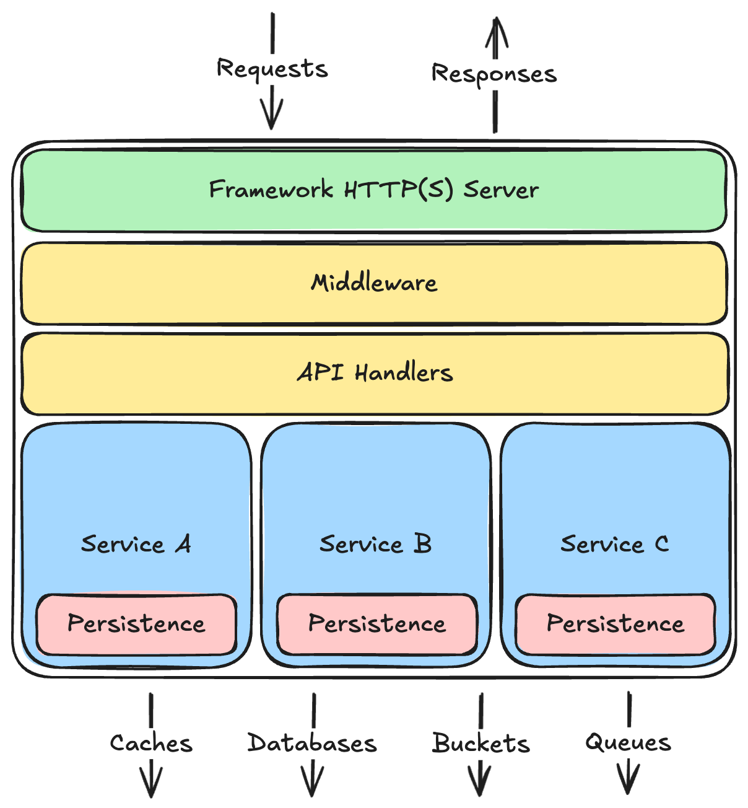
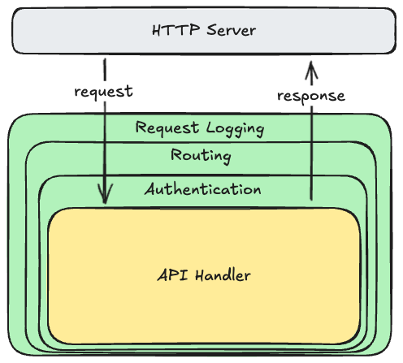

# API Servers

One of the most common [building blocks](building-blocks.md) you will see in systems you create, extend, or maintain are **API servers**.[^1] These are continuously-running programs that listen on a port for incoming requests, process those requests, and write responses. The body of those requests and responses are _structured data_, encoded in something like [JSON](https://www.json.org/json-en.html) or [protobuf](https://protobuf.dev/), as opposed to content formatted for a particular user interface (e.g., HTML for a web browser).

Sending structured data instead of formatted content decouples your API servers from the clients that use them. The clients could be anything from a browser-based web application, to a native mobile application, to a command line utility, or even another API server. These different types of clients have vastly different user interfaces (or none at all), but they can all consume structured data and do something with it. For example, a web app will transform it in to HTML shown on the current page, while a native mobile app will display it in native UI elements, and a command line utility might print it to the terminal.

In this tutorial we will dive into the details of API servers, but this won't be a simple step-by-step guide to building "Hello, World!" in some trendy scripting language. These days, you can just generate that using your favorite AI model. Instead, this tutorial will teach you the universal principles, techniques, and best practices used to build the kind of real-world services you end up using every day. You can apply these to any API server you build, in any programming language, with any framework.

## Internal Architecture

If you use an AI model to generate a "Hello, World!" web server, it will probably spit out a bunch of badly-structured code all in one file. If you were to take this as a template, and simply keep extending it in the same style, with more and more functionality, you'd end up with a giant unmaintainable mess. If you want to build feature-rich servers, you need to adopt a better internal architecture from the start.

But what sort of architecture? When we started building HTTP servers in the 1990s, there wasn't an obvious or established answer to that question. Many tried to replicate the [Model-View-Controller (MVC)](https://en.wikipedia.org/wiki/Model%E2%80%93view%E2%80%93controller) architecture that was used to build desktop applications like word processors and spreadsheets, but this was always a poor fit. MVC was designed for interactive, single-user, stateful, object-oriented applications, where the state was mutated in-memory and re-displayed after every keystroke. HTTP servers are quite different: they are multi-user, mostly-stateless programs that need to process a multitude of concurrent but independent network requests as quickly as possible.

As engineers gained experience with HTTP servers, and as new browser capabilities like [AJAX](https://en.wikipedia.org/wiki/Ajax_(programming)) were released, a common architectural pattern emerged that works well for most kinds of services:



There are a few important things to note about this architecture:

- **Divided into layers, with dependencies only running downward:** Each layer depends on the ones below it, but never on the ones above it. In fact, each layer should have no specific knowledge about layers above it, and shouldn't care if those layers completely change in the future.
- **Layers use each other via internal APIs:** Just like your overall server, each layer exposes an API to the layers above. Higher layers always talk to lower layers through their APIs, and all other code within the layer is considered private to that layer.
- **Each layer has a separate concern:** API handlers only deal with the API semantics, not business rules. Services only enforce business rules, not API semantics, nor persistence details. The persistence layer only knows how to save and load data, not how to properly validate or mutate it, and definitely has no idea what sort of API style the server is using. All of this keeps the layers relatively independent, and keeps core business logic (which tends to change more often than the rest) all in one place.
- **Business logic is vertically segmented into isolated services:** For example, in a social-media style system, the logic pertaining to user accounts should be isolated into an internal service that is separate from the logic pertaining to posts made by those accounts. These services will often need to interact with each other, but that is done through the same internal API the handlers use. This allows you to repackage a service into a separate HTTP server in the future if you need to scale or deploy it independently.
- **Persistence abstracts the data stores and ensures data isolation:** The persistence layer should be the only thing that knows what kind of databases or cache or message queue it talks to--the internal API this layer exposes to the services layer above should be simple enough to be supportable on different kinds of databases so you can change that over time. The persistence layer is also responsible for ensuring services can only read and write their own data, and not the data belonging to other services. This allows services to enforce data validation, and cache safely.

How you organize the code in your repository will likely depend on your chosen programming language and its conventions, but this layering should still be reflected somehow. For example, the code for your API handlers should be in a different directory than the code for your services, or your persistence layer. This will reinforce the logical layers and avoid accidental dependencies.

Now let's examine each layer in particular.

### HTTP(S) Server

The HTTP(S) layer is typically provided by whatever web server framework you are using--you should never have to write this yourself. For example, if you're using Node.js with Express, the Node runtime handles this part. If you're using Rust with Axum, or Python with Flask, or Java with Spring, it's a similar story. In Go, you could use just the standard library, or a more sophisticated package that builds upon it.

Most frameworks offer servers that can speak both version 1 and 2 of HTTP, though some older ones may only support version 1 (and you should probably avoid those for new projects). If you supply a digital certificate and private key when constructing the server, it will also support HTTPS.

This layer is concerned only with managing network connections, protocol negotiation, encryption/decryption, parsing requests, invoking a top-level middleware or handler function, and writing responses to the network. Because it's typically provided by your framework, it's fairly generic and only knows about the top-level middleware or handler function you register with it.

### Middleware

As we built more and more API servers throughout the 2000s, we discovered that we were doing the same sort of things over and over in all of our request handlers: logging, authentication, authorization, routing, response compression, etc. These are things you want to do on all, or at least most, of the requests sent to every API server. It would be handy to implement this logic once, and just inject it into the request processing stack. Thus was born **middleware**.

Middleware is just a fancy term for a function that wraps around your API handler functions, or another middleware function. For each request, the HTTP server invokes the top-level middleware function, which does some work, calls the next function in the chain, and then maybe does some more work after that function returns. Graphically it looks like this:



Because each middleware function wraps around the next, it can do work before and after the inner function executes. For example, the request logging middleware might start a timer and collect some information from the request on the way in (e.g., the method and the resource path), and then write a log line on the way out containing the request/response details and how long it took to process. Other middleware functions only do work on one side: for example the routing middleware will decide which API handler to call based on the request method and resource path, but doesn't need to do anything after that handler returns.

The most common middleware you will see is a request router. This is responsible for deciding which of your API handler functions to invoke depending on what is in the request. For example, you can configure the router to call your `signup()` API handler when the request is for `POST /accounts`, but your `signin()` handler when the request is for `POST /sessions`. In some frameworks the router is exposed as part of the HTTP server, or passed to it during construction, but it's really just a bit of middleware.

Most frameworks come with a wide array of built-in middleware that you can simply plug into the server when you construct it. Most will allow you to write your own middleware functions as well. To see how, consult the documentation for your framework, or ask Copilot to generate some starting code for you. But keep this code separate from the rest of the layers.

### API Handlers

API handlers are just functions that receive a request and return a response. In some frameworks, these functions return nothing and use another input argument to write the response instead (e.g., a `response` or `writer` object), but the gist is the same.

In most "Hello, World!" tutorials, you'll typically see a lot of code in these API handlers, including direct calls to the database. Please hear me when I tell you **that is a very Bad Idea™**. Calls to the database are the responsibility of the persistence layer. Data validation and business rules are the responsibility of some service in the services layer.

The API handler functions should only concern themselves with the details of the API semantics, and nothing else. For example, during an account sign up request, the handler should only construct a `NewAccount` object (defined in the services layer) and pass it to the `AccountsService` (also defined in the services layer). The service will do all the data validation and business logic necessary to create a new `Account` model, and the persistence layer will save that account to the database. If an exception occurs, the API handler catches it and translates it into the appropriate HTTP response status code and message.

The reason for this strict separation is so you can evolve your API separately from your services. For example, many startups will at some point change their API in a backwards incompatible way, but still need to support older clients that haven't yet moved to the new API. Or they may decide to move from a REST style to GraphQL or gRPC or whatever new shiny style emerges in the future. Regardless, both the new and old APIs can use the same set of internal services, making it relatively easy to support both with little code duplication.

### Services

The services layer is where the bulk of your code should be, and all of your business logic. Because all of the HTTP-related details are handled by the layer above, this code won't really be specific to an HTTP server at all--it will be just everyday classes or functions that could be used in a wide variety of contexts. In fact, this same code could be used in your [message queue consumers](building-blocks.md#queues-and-consumers) or [periodic jobs](building-blocks.md#periodic-jobs) just as easily as it can be used in an API server.

In a very simple API server, you might have only one internal service, but in most cases you'll end up having several, one for each distinct domain in your system. For example, a social media system might have a service for accounts, another for posts, another for DMs, and another for notifications. How you segment your domains will depend a lot on what you're building, but it's generally a good idea to keep them somewhat chunky--tons of very small domains is just as bad as a single undifferentiated one.

To ensure these services remain isolated, each should expose an internal API to the handlers and other services that invoke them. What this API looks like will be particular to your programming language: in object-oriented languages it would likely be an interface or class; in functional languages it would be more of a set of related functions in a namespace. Regardless, this internal API should be the _only_ way services can communicate with each other.

There are several reasons for this strict isolation:

- **Services remain encapsulated:** When using a service, you don't need to know anything about its internals--you only need to know how to call its API. When working on the internal code for a service, you know that it's only called from within the service, and never from somewhere else. This makes each service, as well as your overall server, much easier to understand and reason about.
- **Services remain portable:** A single HTTP server with multiple internal services is easier to manage in deployment, but if you decide you need to refactor a service into its own server in order to scale or deploy it independently, you can do so easily. You don't even need to change the other services that call it--just turn the service's API into a stub that makes HTTP requests to the new server!
- **Services ensure data validity:** If data owned by a service can only be changed through that service, the service can ensure the data remains valid according to the business rules, as they are now, and as they change in the future. If services are used in queue consumers and jobs as well, they can also safely cache commonly-fetched data, and invalidate those caches when updates are made.

### Persistence

Since all the business logic is in the services layer, the only thing the persistence layer needs to do is talk to the various data stores. It's only real job is to read and write data, abstracting away the specific database engine the service happens to be using.

If you are using a relational database, a popular option for this persistence layer is an Object-Relational Mapping (ORM) library. ORMs provide a common programming interface over a wide variety of specific database engines, so your service code doesn't have to change if you decide to switch from one engine to another. They also let you define your schema in your application code, and generate scripts to create the corresponding tables and indexes in your database.

That said, if you already know SQL and feel comfortable working with the lower-level database libraries, you can often achieve better performance by writing your own persistence layers. Services typically need only a basic set of read/write operations, so the required SQL usually remains quite simple, and you don't really need the complicated features that most ORMs provide.

## API Styles

Now that we have a feel for all the layers in an API server, it's time to talk about what the API actually looks like to callers. Since this is an HTTP server, the caller ultimately must send HTTP requests and handle HTTP responses, but we have a lot of options for what those requests and responses actually look like.

Over the years a few common API design patterns have emerged, and these days there are really only three that are typically used: REST, RPC, and GraphQL. Let's look at each in turn.

### REST

REST is an acronym that stands for **Re**presentational **S**tate **T**ransfer, which is the name of a design pattern first described by [Roy Fielding](https://en.wikipedia.org/wiki/Roy_Fielding) in his [PhD dissertation](https://ics.uci.edu/~fielding/pubs/dissertation/rest_arch_style.htm). The full details of this pattern are complex and elegant, and few systems follow it completely, but the basic ideas became a very popular choice for API servers over the last couple of decades.

In its most basic form, a REST API exposes a set of logical **resources**, which are the core service objects your API server can manipulate. In a social media system these would be things like Accounts, Posts, DirectMessages, Feeds, Notifications, etc.

Callers refer to these resources using the [resource path](http.md#resource-path) in the HTTP request. This path can be hierarchical, which makes it easy to refer to the set of objects as a whole, or one specific object in the set, or even other objects related to a specific object. For example:

Resource Path | Meaning
--------------|--------
`/accounts` | All accounts in the system
`/accounts/123` | The specific account with the identifier `123`
`/sessions/me` | The currently authenticated account
`/accounts/123/friends` | All accounts that are friends of account `123`
`/accounts/123/posts` | All posts made by account `123`

The words used in resource paths should always be _nouns_ or unique identifiers. Resource paths with verbs, like `/signin` or `/send_email`, should be avoided. Use `POST /sessions` for signing in, and something like `POST /outbox` to send an email.

A REST API also exposes a set of basic **operations** that callers might be able to perform on these resources. The operation is specified as the [method](http.md#methods-and-resources) in the HTTP request. In _theory_ this method could be anything the client and server understand, but in practice the set of methods you can use is often dictated by proxy servers in-between. To be safe, REST APIs tend to use only the core HTTP methods that every server and proxy should support:

Method | Meaning
-------|--------
GET | return the current state of the resource
PUT | completely replace the current state of the resource with the state in the request body
PATCH | partially update the current state of the resource with the partial state in the request body
POST | add a new child resource with the state in the request body
DELETE | delete the resource
OPTIONS | list the methods the current user is allowed to use on this resource

When sending or returning resource state, it should be some text-based format that is easy to work with in the browser as well as other types of clients like native mobile apps. The default choice these days is to use [JSON](https://www.json.org/json-en.html). Because of this, we often refer to REST APIs as REST/JSON APIs.

Combining methods and resource paths, callers can do a wide variety of things:

Method & Path | Meaning
--------------|--------
`POST /accounts` | Create a new system account (sign up)
`POST /sessions` | Create a new authenticated session (sign in)
`GET /sessions/me` | Get the details for the currently authenticated account
`GET /accounts/123/posts` | Get all posts made by account `123`
`POST /posts` | Create a new general post from the currently authenticated account
`DELETE /posts/123` | Delete a previously-created post with the ID `123`
`POST /channels/abc/posts` | Create a new post that is only visible in channel `abc`
`DELETE /sessions/me` | Delete the currently authenticated session (sign out)

`GET` requests against large resource collections will typically return only a page of resources at a time (e.g., 100 records at a time). Otherwise your API server and database will bog down trying to read and transmit far too much data during a single request. Clients can iteratively move through these pages by specifying a `?page=N` [query string parameter](http.md#query-string-parameters-and-values), though it's common to restrict how many pages one can retrieve in total, so that bots can't scrape all of your data.

Large resource collections might also provide limited forms of filtering and sorting via other query string parameters. For example, one might be able to get all posts made during during January 2025 using a request like `GET /accounts/123/posts?between=2025-01-01_2025-02-01`.

The set of method and resource combinations you support becomes your API. Some combinations might be available only during an authenticated session, and some might be allowed only if the authenticated account has permissions to perform the operation (e.g., only the creator of a post can delete it).

When done well, REST APIs are simple, intuitive, and ergonomic. But the REST pattern has some drawbacks:

- It's difficult or clumsy to model more complex operations that don't neatly correspond to the basic HTTP verbs. For example, an API for controlling an audio system might want to expose operations for pausing and resuming the current playlist, but there are no standard HTTP methods for that. One could expose a `PATCH /playlists/current` API to which the client can send `{ "paused": true}`, but that is fairly inelegant and obscure. APIs that needs to do this often should consider an [RPC](#rpc) style instead.
- As the size of a resource's state grows, more and more data is sent to clients, even if they only need a small fraction of it. This gets even worse when returning lists of those resources. One can support partial projections through a query string parameter, but this again becomes clumsy and inelegant. This scenario was one of the motivations for [GraphQL](#graphql).
- If a client needs several different resources all at once, it needs to make several HTTP requests to different resource paths. If the state of one resource determines the resource paths for others, the requests must be done sequentially, which slows down rendering, making the client feel sluggish. This scenario was also a key motivation for [GraphQL](#graphql).
- How does a client know which methods and resource paths are available? And how do they know what kind of data to send in a request, and what shape of data they will receive in the response? Some frameworks in statically-typed languages like Java can generate this sort of documentation automatically from your code, but loosely-typed languages like JavaScript simply don't offer enough information, so you have to write the documentation manually. [RPC](#rpc) and [GraphQL](#graphql) APIs are typically self-documenting.

### RPC

Long before the REST pattern became popular, various kinds of servers exposed APIs that looked more like a set of functions or procedures that clients could invoke remotely. These APIs were just like the ones exposed from internal services, but clients could now call them across a network. This pattern is known as **Remote Procedure Calls**, or RPC, and it actually pre-dates HTTP, but has been adapted to HTTP in recent years.

The most popular implementation of this pattern on HTTP is Google's [**gRPC**](https://grpc.io/). It defines a high-level universal language for describing your API, and includes tooling to generate the corresponding code in a wide variety of languages. It builds upon Google's binary data encoding standard, [Protocol Buffers (protobuf)](https://protobuf.dev/), which is used to define and encode/decode the data structures passed on the wire.

For example, say you wanted to expose an API that could return the basic [Open Graph](https://ogp.me/) properties for a given URL, so that the caller can display a preview card like the ones you see in a social media app. The service definition would look something like this:

```proto
service PreviewExtractor {
	// Extracts preview information for a given URL
	rpc Extract(ExtractRequest) returns (Preview) {}
}

message ExtractRequest {
	// The URL from which to extract preview properties
	string url = 1;
}

// Properties about a URL suitable for 
// showing in a preview card
message Preview {
	// The URL from which these properties were extracted
	string url = 1;
	// The type of content returned from the URL
	string content_type = 2;
	// A title for this content
	optional string title = 3;
	// Zero, one, or multiple preview images
	optional repeated Image preview_image = 4;
}

message Image {
	// The URL that will return this preview image
	string url = 1;
	// The mime type of the image (jpg, png, tiff, etc.)
	string mime_type = 2;
	// The width of the image if known
	optional uint32 width = 3;
	// The height of the image if known
	optional uint32 height = 4;
	// A textural description of the image
	optional string alt_description = 5;
}
```

When you run this through the gRPC tooling, it will generate classes in your specified programming language for each `message` defined in the file. It will also generate an empty `PreviewExtractor` service implementation that you can fill out for the server, as well as a stub class that clients can use to call the procedures. For example, the Python calling code looks as simple as this:

```python
# connect to the server and create the stub once
with grpc.secure_channel('...net address of server...', credentials) as channel:
    preview_extractor = PreviewExtractorStub(channel)

    # calling an API then looks like calling a local method
    preview = preview_extractor.Extract(ExtractRequest(url='https://ogp.me'))

    print(f'page title is {preview.title or "(No Title)"}')
```

The calling stub makes it look to client code like they are just calling a method on a class, but under the hood, the stub class actually makes an HTTP request to the server. The resource path contains the name of the procedure to run, and the request body contains the input message(s) encoded into [protobuf format](https://protobuf.dev/programming-guides/encoding/). The HTTP response body will similarly contain the message returned by the procedure, and the client stub will decode this back into an instance of the class generated for your programming language.

A gRPC API has a few natural advantages:

- The service definition file is effectively self-documenting.
- It is well supported in all the popular programming languages (especially those used by Google).
- Everything is statically typed. The procedures exposed by the service are real methods on the stub, and all inputs and return values are generated classes with explicit properties/methods. This allows IDEs to do statement completion, and compilers or type checkers to catch typos.
- Protobuf encoding is much more compact than JSON, so gRPC tends to be a bit faster than REST/JSON especially when the requests and responses include arrays of objects with many properties.
- It's easy to model APIs that are more action-oriented than resource-oriented.
- Because it is built upon HTTP/2, it supports bidirectional streaming without requiring WebSockets.

The only real drawback of gRPC is that (as of January 2025) it's not possible to directly call a gRPC API from JavaScript running in a web browser. Native mobile apps, command line utilities, and other servers can easily call gRPC APIs, but you can't do so directly using the `fetch()` API in the browser.

There are a few options for working around this limitation, however. One of the most popular is [gRPC Web](https://github.com/grpc/grpc-web), which requires a separate HTTP proxy server sitting between the browser and your gRPC server. This proxy handles converting text-based request/response bodies into protobuf, and switching from HTTP/1 to 2 when necessary.

Another option is [gRPC Gateway](https://github.com/grpc-ecosystem/grpc-gateway), which also requires a separate HTTP proxy server, but this server effectively translates your gRPC API into a REST/JSON one. This translation can't be done automatically, so you do have to provide a good bit of configuration, but once you do, browser apps can go through the REST/JSON proxy, while all other clients can use your gRPC API directly.

### GraphQL

The REST APIs for large social media sites can return _a lot_ of data. Part of this is because they can't really know ahead of time what any given client might need, so they just return _everything_ they know about a resource. The response bodies of these APIs can get enormous, which slows down the network processing and can make the client feel sluggish. And if the client needs multiple resources in order to render a screen, performance gets even worse.

But these REST APIs are ultimately making queries to a database, and those databases already support a flexible query language that lets the caller specify which fields they actually want. They even let you execute multiple queries in one round-trip. So what if we applied those same techniques to our HTTP APIs?

Thus was born [GraphQL](https://graphql.org/learn/). It's essentially a query language for a graph database exposed through an HTTP API. Clients can ask for only the properties they really need, and can fetch multiple related resources all in one HTTP request. In addition to flexible querying, GraphQL APIs can also support [mutations](https://graphql.org/learn/mutations/) through syntax that looks a bit like gRPC.

Unfortunately, when GraphQL was first introduced it received _a lot_ of hype, which caused many engineers to use it regardless of whether it made any sense for their particular API. If your system doesn't have the needs that motivated its creation, GraphQL APIs can actually be harder to implement, complicated to use, and tricky to make performant. Eventually some sanity returned, and engineers realized that it's not _always_ the right choice, which led to even sillier proclamations that it was now dead.

Don't listen to hype cycles. If your API exposes a lot of data that can be organized into a graph, and you want to support clients with unpredictable needs, GraphQL might be a good choice. If not, REST or gRPC might be a better choice. Use the right tool for the job!

## Idempotency

Regardless of which style you choose, if your API allows creating new data, you need to handle the following scenario:

1. Client makes a request to your data creation API.
1. Your server receives and processes that request.
1. But for whatever reason, the client never receives the response. This can happen if your server takes longer to respond than the client's configured timeout, or if there is a network partition/failure that blocks the response from getting back to the client.
1. The client now has no way of knowing whether the operation succeeded or not. How can it safely retry the request without creating duplicate data?

In some systems, creating duplicate data may be OK. For example, if you end up posting the same picture twice to a photo sharing site, no real harm is done, and the user can always delete the duplicate post later. But if you are talking to a payments API, you really don't want to charge your customers payment card twice!

One way to make it safe to retry data creation requests is to make that request **idempotent**. Idempotent operations result in the same outcome whether they are executed just once, or multiple times. Read and delete operations are naturally idempotent, and update operations can be, but data creation operations need something extra to make them idempotent.

That extra thing is some unique value that the client sends with the original request, as well as any retries of that same operation. We often call this an **idempotency key** but others may call it a transaction ID or a logical request ID. Regardless, it is just some value (typically a [UUID](https://en.wikipedia.org/wiki/Universally_unique_identifier)) that is unique for each data creation operation, and included in all retries of that same operation.

This idempotency key allows your API server to disambiguate between new data creation operations it hasn't yet seen, and retries of a previously-processed operation. If you see a request with an idempotency key you've already processed, your API server can stop processing and simply return a successful response.

There are two primary options for how to implement this:

- Use a [cache](building-blocks.md#caches) to track all the idempotency keys you've seen within the last hour (or whatever you want your idempotency duration to be). Each time you receive a request, check the idempotency key against your cache to see if you've already processed it. This works best when your idempotency duration is limited to a relatively short period of time.
- Save the idempotency key with the record created by the operation, and add a unique constraint to that field. If you try to insert the same record again with the same idempotency key, the database will reject the operation, and you can catch/handle that exception in your code. This works best when you want to enforce idempotency for the lifetime of the data created by the operation.

## Concurrency

If your API server allows clients to update existing resources, you need to handle cases where two different clients are trying to update the same resource _at the same time_. For example, a teacher and a TA might both try to update a student's information at the same time. What should happen in that case?

This is known as a **concurrent update** (or more generally a **race condition**), and there are two primary ways to handle it:

1. **Pessimistic controls:** Lock the record when the first client reads it, and block others from updating it until the first client finishes their edits. This is typically another Bad Idea™ as it's way too easy for that first client to step away from their screen and leave the record locked. Systems that use this approach often enforce a time limit on locks, but that just adds more complexity.
1. **Optimistic controls:** Allow both clients to read and attempt the update, but use a conditional write to block the second writer. This forces the second writer to re-read the record and see the change made by the first writer, before deciding if they want to make their change as well. This is the preferred approach whenever the probability of concurrent updates is reasonably low.

Most databases support conditional writes, and the technique looks like this:

1. Add a `version` field to each record, initially set to `0` when inserted.
1. When clients read this record, they will see the current `version`.
1. When clients try to update, they send their changes along with the `version` value they read.
1. Your API server tells the database to update the record, setting `version` to `version + 1`, but only if `version` is still the same value as what the current client read. In SQL this looks like:

```sql
# assuming the client attempting the update 
# read version 0...
update ...
set field1=new_value, ...,  version=1
where id=... and version=0
```

If no other client updated the record in between the time this client read and attempted its update, this SQL will update one record. But if another client did update in between, the `version` field in the database record will now be set to `1`, so the second part of the `where` clause will not match any rows, and this SQL won't change anything. The database will tell you how many rows were affected by the query, and your API server can use that to detect when the current client lost the race. In this scenario, your API server can return an error, the client can `GET` the resource again to the see the changes made by the other client, and the user can attempt their change again if it's still necessary.

## Observability

Unlike a graphical client application, API servers are mostly invisible by default. If you send a request, you'll be able to see the response, but you can't see what it's doing at other times. This makes it especially hard to know when your server is slowing down, running out of memory, encountering unexpected errors, or about to crash.

To overcome this, we typically add some functionality that lets us continuously observe and monitor our system components. For API servers, this usually consists of writing log messages about every request, and publishing various metrics.

### Request and Error Logging

At the very least, your API servers should write a line to the [standard output stream](https://en.wikipedia.org/wiki/Standard_streams#Standard_output_(stdout)) describing every request the server processes. Most web server frameworks will do this for you automatically, or via a request logging middleware library you can add.

You should also log any exception/errors that occur while processing requests. Again, many web server frameworks will do this automatically via try/catch blocks wrapped around your API handlers, but if you catch and handle exceptions lower-down in your services or persistence layers, you should also write those to standard out.

When developing and debugging on your local machine, you can see these messages in the terminal you used to start the server. In deployment, these are typically piped to a logging service like [Splunk](https://www.splunk.com/) or something similar offered by your cloud provider (e.g., [AWS CloudWatch](https://aws.amazon.com/cloudwatch/)).

Frameworks that do request logging automatically will typically include only the most basic details about the request and response: method, resource path, response status code, and latency. But many will let you extend this with other properties from the request and response that might be relevant to your API. For example, if you support idempotency keys for data creation APIs, you could include those in the log messages so you can see when these requests are being retried.

These log messages are useful not only for observing the current set of requests being made to your server, but also diagnosing failures when they occur. For example, if you see a lot of 5xx response status codes in the log, you can look at the exception messages to figure out what happened.

### Metrics

Log messages are mostly useful for diagnosing problems after a failure has occurred, but it's also useful to continuously monitor key metrics for your server, and alert when those metrics go out of acceptable range, _before_ your server crashes.

Key metrics include things like:

- number of requests processed by the server
- latency of those requests at various percentiles
- number of requests with a successful response vs an error response
- number of exceptions caught
- number of queries being sent to the database, and their latency
- number of requests being made to other API servers, and their latency
- amount of memory currently in use, and how much memory is still free
- the percentage of available CPU that is being used

Note that these are values that constantly change over time, so your server must periodically report them in some way. In the past, we typically used a library called [`statsd`](https://github.com/statsd/statsd) to push these to a metrics and dashboard service like Graphite, but in 2025 it's more common to expose them via another API that a metrics service like [Prometheus](https://prometheus.io/) calls periodically.

Most web server frameworks can track and report metrics related to HTTP requests automatically, or via middleware you add. But metrics about requests to your database, or other API services, must be added by your own code. How you do this will depend on what framework and metrics service you use--ask GitHub Copilot or your favorite LLM to generate some example code for your particular context.

Regardless of which metrics service you use, these metrics are used for two things:

- Dashboards that display these metrics on scrolling charts, so you can visualize what your server is doing.
- Automatic alerts that go off when a metric goes outside it's acceptable bounds. For example, you can configure an alert to fire when your server experiences more than five error responses within five consecutive minutes, or when the latency of your APIs gets too high (or whatever makes sense for your API). These alerts can trigger emails, Slack messages, phone calls, or mobile push notifications via a service like [PagerDuty](https://www.pagerduty.com/). When these alerts go off, it's usually a sign that your server is having troubles, and manual intervention might be necessary to avoid a crash.

## Conclusion

We've covered a lot of details in this tutorial, but hopefully you've now learned some of the universal principles, techniques, and best practices professional engineers use to build the kind of real-world services you interact with every day. 

We saw how to architect the internals of your API server to make it easier to maintain and extend them. We discussed the various kinds of styles you can use for the APIs you expose from your servers, and when you might choose one of the others. We learned how to make data creation APIs idempotent, and how to handle concurrent updates. We emphasized the importance of making your servers observable, and alerting when their metrics go outside acceptable bounds.

These principles and techniques can be applied to any API server you build, regardless of what programming language or framework you use.

## Notes

[^1]: If you've never heard the term "API" before, or if you're not entirely sure what it really means, it stands for Application Programming Interface. This is a generic term that refers to the way one program (or part of a program) interfaces with another. This is similar to, but different from, a "User Interface," which is the interface (often graphical) that a human uses to interact with an application. Your API servers will expose a programming interface to client applications, but the layers _within_ your API server also expose internal APIs to the layer above. APIs are kind of like menus--they offer a list of things you can ask for, without you having to know anything about how those dishes are made (and sometimes, you just don't want to know). In this way, an API 'abstracts' the inner workings of the component, presenting a contract for how to use it that can remain stable even as the internal implementation changes over time.