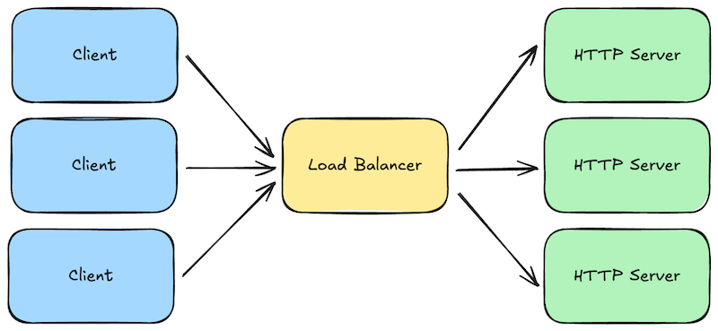
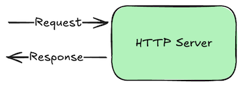
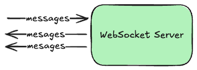
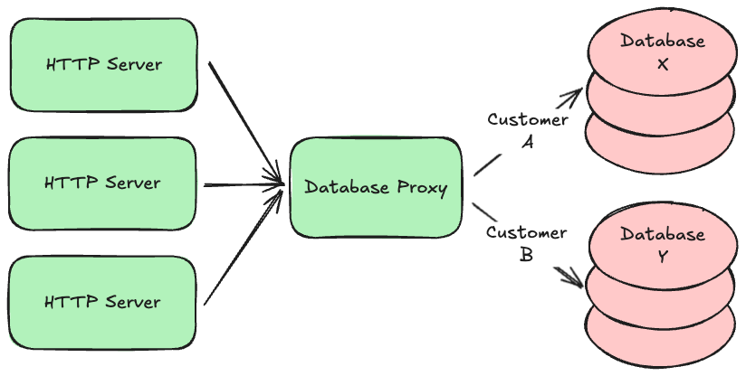
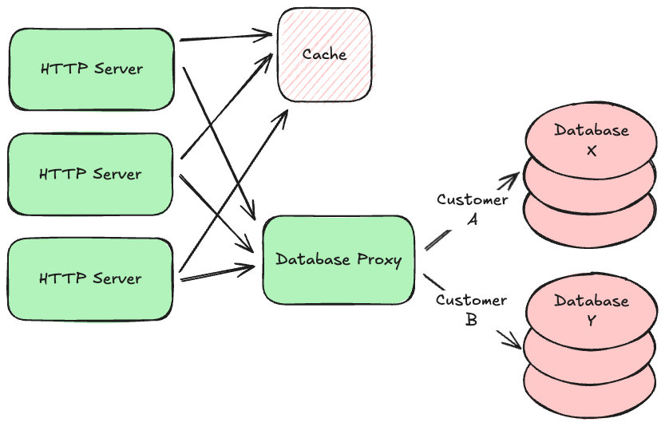
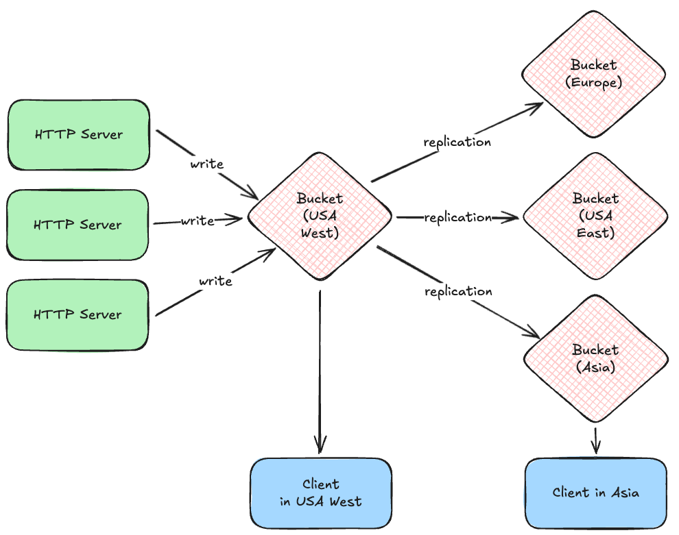
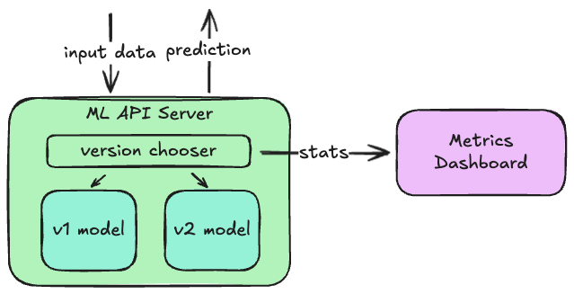

# System Building Blocks

If you were to look at the architectures of the web sites you use most often, you would probably notice a lot of similarities. Most will have a set of HTTP servers, with load balancers in front, that respond to requests from clients. Those servers will likely talk to databases, caches, queues, and buckets to manage data. They might also use machine-learning (ML) models to make predictions. Event consumers will respond to new messages written to the queues, or changes to database records. Other jobs will run periodically to archive data, re-train ML models with new data, or perform other routine tasks. What these components _do_ will no doubt vary from system to system, but the _types_ of components used will come from a relatively small set of common building blocks.

This tutorial will give you an overview of these common building blocks. We will learn what each is typically used for, and some common options or variations you might see in practice. Once you understand these building blocks, you can combine them in various ways to build just about any kind of system.

## Load Balancers and API Gateways

When a request is made to your web servers, either by a web browser or by a client calling your application programming interface (API), the first major system component to receive those requests is typically a **load balancer**. These are the front door to your system.

Load balancers are fairly generic components, meaning they are typically open-source software programs that can be used "off the shelf" with just a minimal amount of configuration. Popular examples include [NGINX](https://nginx.org/) and [HAProxy](https://www.haproxy.org/). Cloud providers also offer these as hosted services you can simply deploy--for example, [AWS Elastic Load Balancer](https://aws.amazon.com/elasticloadbalancing/) or [Azure Load Balancer](https://learn.microsoft.com/en-us/azure/load-balancer/load-balancer-overview).

Load balancers perform several jobs that are critical to building highly-scalable and reliable systems:

* **Load Balancing:** Not surprisingly, the primary job of a load balancer is to distribute requests across a fleet of your "downstream" HTTP servers (i.e., load balancing). You configure the IP addresses for your domain to point to the load balancers, and each load balancer is configured with a set of addresses it can forward those requests to. The set of downstream addresses can then change over time as you roll out new versions or scale up/down. Balancers typically offer multiple strategies for balancing the load, from simple [round-robin](https://www.cloudflare.com/learning/performance/types-of-load-balancing-algorithms/) to more sophisticated ones that pay attention to how long requests are taking and how many outstanding requests each downstream server already has.
* **Blocking and Rate Limiting:** Load balancers also protect your downstream HTTP servers from attack and abuse. They are specifically designed to handle massive amounts of requests, and can be configured to block particular sources of traffic. They can also limit the number of requests a given client can make during a given time duration, so that one client doesn't hog all the system resources.
* **Caching:** If your downstream HTTP servers mostly return static content that rarely changes, you can configure your load balancers to cache and replay some responses for a period of time. This reduces the load on your downstream servers.
* **Request/Response Logging:** Load balancers can be configured to log some data about each request and response so that you can analyze your traffic, or diagnose problems reported by your customers.
* **[HTTPS](https://en.wikipedia.org/wiki/HTTPS) Termination:** If your load balancer and downstream servers are all inside a trusted private network, and you don't require secure/encrypted connections between your own servers, you can configure your load balancer to talk HTTPS with the Internet, but HTTP with your downstream servers. This used to be a common configuration when CPU speeds made HTTPS much slower than HTTP, but these days (in 2025) it's common to just [use HTTPS everywhere](https://letsencrypt.org/).

Load balancers are sometimes referred to as **reverse proxies** because they essentially do the reverse of a client-side proxy. Instead of collecting and forwarding requests from multiple clients within an organization's internal network, load balancers collect requests from the Internet and forward forward them to downstream servers within your system.

Although load balancers can be used off-the-shelf with minimal configuration, many now support much more customized behavior via scripting. This customized behavior can be very specific to your use case, but common examples include:

* **Authentication:** If your servers and clients exchange [digitally-signed](crypto.md#digital-signatures) authentication tokens, your load balancer scripts can verify the token signatures, and block obvious attempts to hijack sessions by tampering with those tokens. This reduces obviously fraudulent load on your downstream servers, saving resources.
* **Authorization:** Your scripts could also look up whether the authenticated user has permission to make the request they are making.
* **Request Validation:** If requests contain data that is easy to validate, you can perform those simple validations on your load balancers to block obviously invalid requests before they get to your downstream servers.
* **Request Versioning:** Sometimes you will want to change the API on your downstream servers, but you can't force your existing clients to change their code, so you have to support multiple versions of your API at the same time. Your load balancer scripts can translate version 1 requests into version 2, and version 2 responses back into version 1 responses.

All of this custom functionality _could_ occur within your downstream HTTP servers, but if you can move some of it into your load balancers, you can block obviously invalid requests early, reducing the load on your downstream servers. Load balancers are typically written in a high-performance language like C++ or Rust, so they can often handle much more load than downstream servers written in less-performant and scalable scripting languages like Python, Ruby, or JavaScript.

When load balancers become highly-customized for a given system, we often start to refer to them as **API Gateways** instead to reflect that they are specific to a particular Application Programming Interface (API). But they still serve the basic jobs described above, acting as the front door to the rest of your system.

## HTTP Servers

Load balancers forward requests to one or more **HTTP servers**. These are simply programs that run continuously, listen for incoming requests on a given network port number, and write responses.

What makes them HTTP servers in particular is that the requests and responses adhere to the [Hypertext Transfer Protocol (HTTP)](http.md) standard. This is a relatively simple request/response protocol, so it's quite easy to support. Nearly every programming language has built-in or library frameworks for building HTTP servers.

By default, HTTP is not [encrypted](crypto.md#encryption)), but we can add encryption by getting a [digital certificate](crypto.md#digital-certificates) and supporting **HTTPS**, which stands for "HTTP Secure". The core protocol remains the same, but the messages sent back and forth are encrypted using **Transport Layer Security (TLS)**, and clients can use the digital certificate to verify that they are really talking to the server they think they are talking to.

Some HTTP servers are really just glorified file servers. Clients can request files from a specific directory on the server's disk, and in some cases, the server might allow clients to update those files as well. These files are typically those that comprise the content of web pages: HTML, CSS, various image and video formats, and JavaScript.

But these days (in 2025) it's more common to build HTTP servers that send and receive _structured data_ instead of formatted content. For example, instead of returning a formatted HTML page showing the contents of your social media feed, these kinds of servers return just the data, encoded in an easily interpreted text-based format, such as [JSON](https://www.json.org/json-en.html). Clients can then use that JSON in any way they want.

This decoupling is very powerful: it allows the same HTTP server to support many types of application platforms that render content very differently. For example, a web client can transform the JSON into HTML to display within a web page, while a native mobile app will put it into native UI elements. Scripts or AI models might only need the data itself, combining or transforming it before sending it somewhere else.

Because these kinds of HTTP servers expose a programming interface to applications, as opposed to files on disk, they are often referred to as [**API servers**](api-servers.md). Strictly speaking, they are "HTTP API servers" because they speak HTTP and not some other networking protocol, but HTTP is such a default choice these days that we typically leave off the "HTTP" part.

## WebSocket Servers

Although HTTP is built on top of lower-level network sockets, it remains a very simple request/response protocol. Clients can make requests to servers, and the servers can respond, but the server can't tell the client about something without the client asking about it first. This is fine when your system only needs to answer questions posed by clients, but what if your system also needs to notify those clients about something they haven't asked about yet?

In these cases we use the bi-directional **WebSockets** protocol instead, which allows either side of the conversation to send a new message at any time. Clients can still send request-like messages, and the server can send response-like messages in return, but the server can also send unsolicited messages to the client whenever it wants to. For example, the server might notify clients about new posts to a channel made by other clients, or that a long-running asynchronous job is now complete.

To get a WebSocket connection, clients actually start by talking HTTP and then requesting an "upgrade" to WebSockets. This allows a server to support both HTTP **and** WebSocket conversations over the same port number, which is handy when clients are behind a firewall that only allows traffic to the Internet over the customary web port numbers.

Once connected, both the server and the client can send messages to each other at any time. But either side may disconnect at any time as well, so your client and server code must be written to handle this. Typically we use [queues and consumers](#queues-and-consumers) in front of a WebSocket connection to ensure that all messages eventually get delivered to the other side. But if speed is more important than guaranteed delivered (e.g., multi-player games), just write directly to the WebSocket and discard messages that fail to send.

## Databases

Most systems will eventually accept new data that you want to keep around for a while, and you typically need to ensure that data doesn't accidentally get lost. The natural home for data like this is a persistent database with good durability guarantees.

There are several kinds of databases used to build transaction processing systems:

* **Relational (SQL):** The most common kind of database where data is organized into a set of tables, each of which has an explicit set of columns. Data can be flexibly queried by filtering and joining table rows together using common keys. Most relational databases also support transactions, which allow you to make multiple writes to different tables atomically. Common open-source examples include [PostgreSQL](https://www.postgresql.org/), [MySQL](https://www.mysql.com/), and [MariaDB](https://mariadb.org/). Most cloud providers also offer hosted versions of these, with automated backups.
* **Document/Property-Oriented (aka "No SQL"):** Instead of organizing the data into tables with explicit columns, these databases allow you to store records containing any set of properties, and those properties can in theory vary from record to record (though they often don't in practice). In some systems you can only read and write a single document at a time given its unique key, but others support indexes and quasi-SQL querying capabilities. Common open-source examples include [MongoDB](https://www.mongodb.com/), [CouchDB](https://couchdb.apache.org/), and [Cassandra](https://cassandra.apache.org/_/index.html). Most cloud providers also offer their own hosted solutions, such as [DynamoDB](https://aws.amazon.com/dynamodb/) or [Spanner](https://cloud.google.com/spanner).
* **Simple Key/Value:** Very simple but extremely fast data stores that only support reading and writing opaque binary values with a unique key. Common open-source examples include [LevelDB](https://en.wikipedia.org/wiki/LevelDB) and its successor [RocksDB](https://rocksdb.org/). These are currently just embedded libraries, so one typically builds a server around them to enable access to the database across a network.

Complex systems may use multiple types of databases at the same time. For example, your highly-structured billing records might be stored in a relational database, while your loosely-structured customer profile records might be stored in a document-oriented database.

Regardless of which type you use, it is common to **partition** or **"shard"** your data across multiple database servers. For example, data belonging to customer A might exist on database server X, while data belonging to customer B might exist on database server Y. This allows your system to continue scaling up as the amount of data you store increases beyond what a single database server can handle. Knowing where a given customer's data lives is often delegated to a component in the middle, similar to a load balancer or proxy, that directs requests to the appropriate locations. This allows you to change the partitioning strategy over time without having to update all your API servers.

Many of the hosted databases offered by cloud providers do this partitioning automatically--for example, both DynamoDB and Aurora automatically partition your data so that your data size can grow almost indefinitely. If you self-host your databases instead, look for an open-source partitioning proxy for your particular database engine (most have one).

Many database engines also support **clustering** where each partition consists of multiple physical servers working together as a single logical database. One server is typically elected to be the **primary** or **leader**. The others are known as **secondaries**, **followers**, or **read replicas**. Writes are always sent first to the primary, which replicates those writes to the secondaries. If strong durability is required, the primary will wait until a majority of the secondaries acknowledge the write before returning a response. If the secondaries are spread across multiple physical data centers, it then becomes extremely unlikely you will lose data, but your writes will take longer due to all the extra network hops.

Clusters also provide high availability by monitoring the primary and automatically electing a new one if it becomes unresponsive. The primary can then be fixed or replaced, and rejoin the cluster as a secondary. This process can also be used to incrementally upgrade the database engine software while keeping the cluster online and available.

Since all secondaries eventually get a copy of the same data, reads are often routed to the secondaries, especially if the calling application can tolerate slightly stale data. If not, the application can read from a majority of the secondaries and use the most up-to-date response. This keeps read traffic off of the primary so that it can handle a higher volume of writes.

## Caches

In some kinds of systems, requests that read data far outnumber requests that write new data. We call these **read-heavy** systems as opposed to **write-heavy** ones. Read-heavy systems often benefit from **caches**, which are very fast, in-memory, non-durable key/value stores. They are typically used to hold on to data that takes a while to gather or calculate, but will likely be requested again in the near future. For example, social media sites often use caches to hold on to the contents of your feed so that they can render it more quickly the next time you view it. Popular open-source caches include [redis](https://redis.io/) and [memcached](https://memcached.org/).

Using a cache is about making a tradeoff between performance and data freshness. Since the data in the cache is a snapshot of data from your persistent database (or some other service), that data might have changed since you put the snapshot in the cache. But if you know that data doesn't tend to change very often, or if your application can tolerate slightly stale data in some circumstances, reading from your cache instead of the original source will not only be faster, it will also reduce load on that source.

The main tuning parameter for this tradeoff is the **Time to Live (TTL)** setting for each value you put in the cache. This is the time duration for which the cache will hold on to the data. After the TTL expires, the cache will "forget" the data, and your application will have to read a fresh version again from the original source. A short TTL will improve data freshness but decrease performance, while a long TTL will do the opposite.

If your HTTP server tries to load some data from the cache but it's no longer there (known as a **cache miss**), getting that data will actually be _slower_ than if you didn't have a cache at all, as your server had to make an additional network round-trip to the cache before going to the source. This is why _it's never free to just add a cache_. You should only add one when you are confident that it will improve your average system performance. Analyze your system metrics before and after the introduction of a cache, and if it doesn't result in a noticeable improvement, remove it.

## Buckets

Databases are fantastic for small structured data records, but they are a poor choice for large binary content like documents, pictures, video, or music. These kinds of files are often referred to as **BLOBs** or "Binary Large Objects" and the best home for them are buckets.

A **bucket** is like a file system that is hosted by your cloud provider. You can write files to a particular file path, read them given that path, and list paths given a common prefix. Examples include [AWS S3](https://aws.amazon.com/s3/), [Google Cloud Storage](https://cloud.google.com/storage/docs/introduction), and [Azure Blob Storage](https://azure.microsoft.com/en-us/products/storage/blobs). 

Buckets are designed to store large numbers of potentially huge files, but most lack the ability to store structured metadata about those files, so we often combine them with databases. For example, a social media system might store a structured record about your post in a database, but put the pictures or videos attached to your post into a bucket.

Most cloud providers give you the option of replicating bucket files between geographic regions, and obtaining region-specific URLs for files, so that your clients can quickly download them. For example, your system might write files initially to a bucket in a USA west coast data center, but those are quickly replicated to other regions, allowing a client in Asia to download the file from a much closer data center.

## Queues and Consumers

When your HTTP server processes a request, it will likely need to read or write some data synchronously (i.e., before responding to the client), but some work could be done asynchronously. For example, when a customer signs up for a new account, the HTTP server must write a new record in the accounts database, but sending a confirmation or welcome email could be done later. To ensure this task actually gets done, we typically use a queue.

A **queue** is a special kind of database that tracks an ordered list of transient records, which are often called **messages**. Your HTTP server (or any system component) can **publish** new messages to the end of the queue, and other components **consume** those messages from the head of the queue, processing them in some way (e.g., send an email). If there are multiple consumers, queues can be configured to deliver each message to the first available consumer (job queue model), or each message to _all_ consumers (broadcast model). Some queues will remove messages after consumers acknowledge successful processing, while others make consumers track where in the queue they would like to start reading.

Another common use of a queue is as a source for notifications that a WebSocket server should send to clients. For example, when a user makes a new posts to a social media system, the HTTP server processing that request will write the post to the database (and maybe attached media files to a bucket), and then publish a message about the post to a queue. The WebSocket servers then consume those messages from the queue, forwarding each message to all connected clients. This allows clients to immediately display the new post without having to ask the server for it.

Many queues will let you define multiple **topics** within the same server, which allows you to have multiple independent streams of messages. Different consumers can read from different topics: for example, you might define one topic for "new accounts" and another for "password resets" and have different consumers dedicated to each.

The most sophisticated queues also support running in clusters, similar to the database clusters discussed earlier. This allows the queue to remain available even when one of the servers goes down, or needs to be upgraded. It can also ensure durability by replicating new messages to a majority of the secondaries before responding to the publisher.

Common examples of open-source self-hosted queues are [Kafka](https://kafka.apache.org/) and [RabbitMQ](https://www.rabbitmq.com/). Cloud providers also offer hosted versions of these products, or their own queuing solutions, such as [AWS MSK](https://aws.amazon.com/msk/) or [AWS SQS](https://aws.amazon.com/sqs/).

## Periodic Jobs

So far all the system components we've discussed run continuously and react to things like synchronous requests or an asynchronous messages published to a queue. But in many systems we need other components that just run periodically, on a schedule. For example, payment systems need to generate clearing files of all approved transactions at least once a day and send them to the payment network. Or a system with an ML model might want to retrain that model once a week based on new observations.

These **periodic jobs** are just scripts that get executed by a scheduler. They start, run to completion, and exit. In between runs, nothing is executing except for the scheduler.

The schedulers primary job is to run jobs at the appropriate times, but most schedulers also record information about each run, including detailed log messages written by jobs as they execute. This allows operators to view whether jobs encountered errors, and diagnose the cause.

Examples of periodic job schedulers range from the simple yet tried and true [cron](https://en.wikipedia.org/wiki/Cron) to the very sophisticated and resilient [Temporal](https://temporal.io/).

## ML Models

Many systems these days also use Machine Learning (ML) models to make predictions about the data they are processing, or the actions their users will likely take next. For example, a social media system might use ML models to predict tags for new images, or to screen new posts for malicious content. A payment system might use them to predict the probability of fraud, or the likelihood it will be declined.

Sometimes these models can be run in-process with the main API servers, but it's more common to host these in their own API server that are then called by either the main API servers or a message queue consumer. This is especially useful when you want to test new versions of a model: a small portion of requests can be routed to the new model, and its predictions can be compared to those made by the older model for the other requests. If the distributions of predictions is not what you expect, you can quickly switch back to the previous version without needing to update the callers.

## Metrics and Logs

Unlike GUI clients, server-side components are pretty invisible on their own: you can make a request and observe the response, but you can't really see the requests made by others or how well they are being processed. To make our system **observable** we publish metrics and logs from all the components. These are sent to, or collected by, other components that let us view these metrics on dashboard charts, or query the logs.

The most popular open-source metrics solution these days is [Prometheus](https://prometheus.io/), which periodically gathers metrics from all your servers, aggregates and monitors them, and provides a query API to dashboard clients like [Grafana](https://grafana.com/). When metrics stray outside your established normal bounds, Prometheus can send alerts to your team via email, Slack, or [PagerDuty](https://www.pagerduty.com/).

Metrics can include machine-level things like CPU and memory usage, or API-level things like the percentage of error responses or the request latency distribution. When these metrics go out of tolerance, it's likely a sign that something bad is happening, and an operator might need to intervene to keep the system running properly.

Log messages are typically written by a server to its standard output stream, and that can be read by various logging services. The most popular these days is [Splunk](https://www.splunk.com/), which provides a very sophisticated query language. API servers typically write log lines about every request they process, and every error they encounter, so that operators can get detailed information about what is happening and what went wrong.

## Conclusion

Most systems you use every day are comprised of these basic building-blocks. Now that you know what they are and what to use them for, we can combine them to produce just about any sort of system we want to build!
