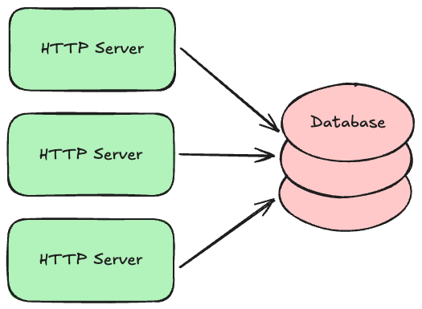

# System Building Blocks

If you were to look behind the scenes of the web sites you use most often, you would probably notice a lot of similarities. Most will have a set of HTTP servers, with load balancers in front, that respond to requests from clients. Those servers will likely talk to databases, caches, queues, and buckets to manage data. They might also use machine-learning (ML) models to make predictions. Event consumers will respond to new events written to the queues, or changes to those database records. Other jobs will run periodically to archive data, re-train ML models with new data, or perform other routine tasks. What these components _do_ will no doubt vary from system to system, but the _types_ of components used will come from a relatively small set of common building blocks.

This tutorial will give you an overview of these common building blocks. We will learn what each is typically used for, and some common options or variations you might see in practice. Once you understand these building blocks, you can combine them in various ways to build just about any kind of system.

## Load Balancers and API Gateways

When a request is made to your web servers, either by a web browser or by a client calling your application programming interface (API), the first major system component to receive those requests is typically a **load balancer**. These are the front door to your system.

Load balancers are fairly generic components, meaning they are typically open-source software programs that can be used "off the shelf" with just a minimal amount of configuration. Popular examples include [NGINX](https://nginx.org/) and [HAProxy](https://www.haproxy.org/). Cloud providers also offer these as hosted services you can simply deploy--for example, [AWS Elastic Load Balancer](https://aws.amazon.com/elasticloadbalancing/) or [Azure Load Balancer](https://learn.microsoft.com/en-us/azure/load-balancer/load-balancer-overview).

Load balancers perform several jobs that are critical to building highly-scalable and reliable systems:

* **Load Balancing:** Not surprisingly, the primary job of a load balancer is to distribute requests across a fleet of your "downstream" HTTP servers (i.e., load balancing). You configure the IP addresses for your domain to point to the load balancers, and each load balancer is configured with a set of addresses it can forward those requests to. The set of downstream addresses can then change over time as you roll out new versions or scale up/down. Balancers typically offer multiple strategies for balancing the load, from simple [round-robin](https://www.cloudflare.com/learning/performance/types-of-load-balancing-algorithms/) to more sophisticated ones that pay attention to how long requests are taking and how many outstanding requests each downstream server already has.
* **Blocking and Rate Limiting:** Load balancers also protect your downstream HTTP servers from attack and abuse. They are specifically designed to handle massive amounts of requests, and can be configured to block particular sources of traffic. They can also limit the number of requests a given clients can make during a given time duration, so that particular clients can't hog all the system resources.
* **Caching:** If your downstream HTTP servers mostly return static content that rarely changes, you can configure your load balancers to cache and replay responses for a period of time. This reduces the load on your downstream servers.
* **Request/Response Logging:** Load balancers can be configured to log some data about each request and response so that you can analyze your traffic, or diagnose problems reported by your customers.
* **[HTTPS](https://en.wikipedia.org/wiki/HTTPS) Termination:** If your load balancer and downstream servers are all inside a trusted private network, and you don't require secure/encrypted connections between your own servers, you can configure your load balancer to talk HTTPS with the Internet, but HTTP with your downstream servers. This used to be a common configuration when CPU speeds made HTTPS much slower than HTTP, but these days (in 2025) it's common to just use HTTPS everywhere.

Load balancers are sometimes referred to as **reverse proxies** because they essentially do the reverse of a client-side proxy. Instead of collecting and forwarding requests from multiple clients within an organization's internal network, load balancers forward requests to one or more target servers within your system's network.

Although load balancers can be used off-the-shelf with minimal configuration, many now support much more customized behavior via scripting. This customized behavior can be very specific to your use case, but common examples include:

* **Authentication:** If your servers and clients exchange [digitally-signed](crypto.md#digital-signatures) authentication tokens, your load balancer scripts can verify the token signatures, and block obvious attempts to hijack sessions by tampering with those tokens. This reduces obviously fraudulent load on your downstream servers, saving resources.
* **Authorization:** Your scripts could also look up whether the authenticated user has permission to make the request they are making.
* **Request Validation:** If requests contain data that is easy to validate, you can perform those simple validations on your load balancers to block obviously invalid requests before they get to your downstream servers.
* **Request Versioning:** Sometimes you will want to change the API on your downstream servers, but you can't force your existing clients to change their code, so you have to support multiple versions of your API at the same time. Your load balancer scripts can translate version 1 requests into version 2, and version 2 responses back into version 1 responses.

All of this custom functionality _could_ occur within your downstream HTTP servers, but if you can move some of it into your load balancers, you can block obviously invalid requests early, reducing the load on your downstream servers. Load balancers are typically written in a high-performance language like C++ or Rust, so they can often handle much more load than downstream servers written in less-performant scripting languages like Python, Ruby, or JavaScript.

When load balancers become highly-customized for a given system, we often start to refer to them as **API Gateways** instead to reflect that they are specific to a given API. But they still serve the basic jobs described above, acting as the front door to the rest of your system.

## HTTP Servers

Load balancers forward requests to one or more **HTTP servers**. These are simply programs that run continuously, listen for incoming requests on a given network port number, and write responses.

What makes them HTTP servers in particular is that the requests and responses adhere to the [Hypertext Transfer Protocol (HTTP)](http.md) standard. This is a relatively simple request/response protocol, so it's quite simple to support. HTTP can also be used with [encryption](crypto.md#encryption) and [digital certificates](crypto.md#digital-certificates) for secure communication, which is known as Transport Layer Security (TLS). When HTTP is combined with TLS, it's known as **HTTPS**.

HTTP requests can contain several pieces of information, but the two critical ones are the **resource path** and the **method** the client wants to perform on that resource. Resource paths are the "nouns" of the request. They are just arbitrary strings that name specific resources the server can manipulate, such as files, database records, other servers, or even specialized hardware. Methods are the "verbs" or operation the client wants to perform on those resources. For example, a `GET /` might be asking to read the root resource of the server, while a `PUT /foo` request might be asking to update the content of the `/foo` resource

Some HTTP servers are really just glorified file servers: the resource paths map directly to files on the server's disk, and clients can receive a copy of them by making HTTP `GET` requests for specific file paths. These files are typically those that comprise web pages: HTML, CSS, various image and video formats, and JavaScript.

But these days (in 2025) it's more common to build HTTP servers that send and receive _raw data_ instead of formatted content. This raw data is still encoded in some sort of easily interpreted text-based format, such as [JSON](https://www.json.org/json-en.html), but clients are then free to do with it what they want. This decoupling is very powerful, as it allows the same HTTP server to support clients on multiple types of application platforms: web apps, native mobile apps, VR simulations, AI agents, or whatever springs up in the future.

Requests to these data-only HTTP servers still include a resource path and method, but that resource path no longer maps to a file on disk. Instead it could map to a database table, or a specific record in that table, or some procedure/function in the server's code that the client can execute. The method might indicate a [CRUD](https://en.wikipedia.org/wiki/Create,_read,_update_and_delete) operation to perform on the database table/record, or it might a read-only vs read-write mode. 

The set of resource paths and methods supported by your server are known as its Application Programming Interface (API). What those look like are entirely up to you, but most systems use one of a few common patterns:

* **[REST](rest.md):** An API style where the resource paths name objects/records, or collections of those, and the methods indicate the CRUD operation the client wishes to perform on them. The [original articulation of this style](https://ics.uci.edu/~fielding/pubs/dissertation/fielding_dissertation.pdf#page=94) is much more powerful and nuanced, but very few systems actually implement it in full. Nevertheless, this is the most common API style used today (2025).
* **RPC:** An API style where the resource path names a specific procedure or method to invoke on the server. The HTTP method doesn't really matter much in this style, so it's commonly just `POST` for all requests. This style is more often used for _internal_ services, and less so for public APIs. The most popular framework for this style is [gRPC](https://grpc.io/).
* **[GraphQL](https://graphql.org/):** An API style that is similar to making SQL queries against a database--servers expose a graph of objects, and clients can query that graph using a structured syntax. This is commonly used by social media systems, as they can't often predict what clients will need from their extensive content graph.

Note that it is possible for a single HTTP server to expose multiple APIs of different styles at the same time. This is often done when a system is in the middle of transitioning from one style to the other, and the server needs to support clients that have already switched to the new style as well as those that are still using the old style.

Because these kinds of HTTP servers expose an API, they are often referred to as **API servers**. Strictly speaking, they are "HTTP API servers" but HTTP has become such a default protocol for API servers that people often just leave off the "HTTP" part. You will also hear people refer to these as simply **services** because each one provides a particular service to the rest of the system.

## WebSocket Servers

Although HTTP is built on top of lower-level network sockets, it remains a very simple request/response protocol. Clients can make requests to servers, and the servers can respond, but the server can never initiate a new conversation, or tell the client about something without it asking first. This is fine when your system only needs to answer questions posed by clients, but what if your system needs to notify those clients about something they don't yet know about?

In these cases we use the bi-directional WebSockets protocol instead, which allows either side of the conversation to send a new message at any time. Clients can still send request-like messages, and the server can send response-like messages in return, but the server can also send unsolicited messages to the client whenever it wants to. For example, the server might notify instant messaging clients about new messages that other clients just sent.

To get a WebSocket connection, clients actually start by talking HTTP to your server and then requesting an "upgrade" to WebSockets. This allows a server to support both HTTP **and** WebSocket conversations over the same port number, which is handy when clients are behind a firewall that only allows traffic to the Internet over the customary web port numbers (80 for HTTP and 443 for encrypted HTTPS).

You might be wondering, why we don't just always use WebSockets instead of HTTP? If a WebSocket server can do everything an HTTP server can do and more, why use basic HTTP at all? There are two primary reasons:

* **Harder Programming Model:** WebSocket servers can send unsolicited messages to clients, which means those clients need to be ready to receive and process them. This can be a harder programming model to support than simple request/response, where clients only need to handle responses to their specific requests. This is certainly true for scripts, but [GUI](https://en.wikipedia.org/wiki/Graphical_user_interface) clients built using a [reactive programming style](https://en.wikipedia.org/wiki/Reactive_programming) can handle WebSockets more easily.
* **Scalability Concerns:** Before load balancers were extended to proxy WebSocket traffic as well as HTTP, the long-running WebSocket conversations between clients and servers made it harder to scale up/down, so older engineers will often have scalability concerns about WebSockets. But as long as you use a load balancer, keep your conversations stateless (i.e., messages sent from clients can be routed to any of your WebSocket servers), and reconnect every so often, WebSockets can scale just as well as HTTP.
* **Missed Messages:** Network connections are unreliable, and clients might disappear at any time. If your server wants to send a notification to a client, but the client is unreachable at the moment, you have to decide how to handle that. In some cases you can simply discard the message and move on (e.g., time-sensitive notification that won't matter later), but in other cases your server will need to resend the message when the client reconnects. This adds some complexity but [event queues](#event-queues) can make this easier to manage.

These days you can think of WebSockets as potentially another API style your servers can support when you want to notify long-running GUI clients about things that happen on the server-side.

## Databases

Regardless of the API style your server supports, it will very likely need to read and write important data that you can't lose. The natural home for data like this is a persistent database with good durability guarantees.

There are several kinds of databases used to build transaction processing systems:

* **Relational (SQL):** The most common kind of database where data is organized into a set of tables, each of which has an explicit set of columns. Data can be flexibly queried by filtering and "joining" table rows together using common keys. Common open-source examples include [PostgreSQL](https://www.postgresql.org/), [MySQL](https://www.mysql.com/), and [MariaDB](https://mariadb.org/). You can also get hosted versions of these from most cloud providers.
* **Document/Property-Oriented:** Instead of organizing the data into tables with explicit columns, these databases allow you to store any kind of document, with any set of properties, and those properties can in theory vary from record to record (though they often don't in practice). In some systems you can only read and write a single document at a time given its unique key, but others allow secondary indexes and quasi-SQL querying capabilities. Common open-source examples include [MongoDB](https://www.mongodb.com/) and [Cassandra](https://cassandra.apache.org/_/index.html), but cloud providers also offer their own hosted solutions, such as [DynamoDB](https://aws.amazon.com/dynamodb/) or [Spanner](https://cloud.google.com/spanner).
* **Simple Key/Value:** Very simple but extremely fast data stores that only support reading and writing opaque binary values with a unique key. Common open-source examples include [LevelDB](https://en.wikipedia.org/wiki/LevelDB) and its successor [RocksDB](https://rocksdb.org/).

Complex systems may use multiple types of databases at the same time. For example, your highly-structured billing records might use a Relational database, while your loosely-structured customer detail records might use a Document-oriented database.

Regardless of which type you use, it is common to partition or "shard" your data across multiple database servers. For example, data belonging to customer A might exist on database server X, while data belonging to customer B might exist on database server Y. This allows your system to continue scaling up as the amount of data you store increases beyond what a single database server can handle. There will typically be a component in the middle, similar to a load balancer, that directs requests to the appropriate database server so that the partitioning strategy can change over time. 

Many of the hosted databases offered by cloud providers do this partitioning automatically--for example, both DynamoDB and Aurora automatically partition your data so that your data size can grow indefinitely, though you will pay for this in higher fees.

Many database engines also support **clustering** where each partition consists of multiple database servers working together. One server is typically voted to be the **primary** or **leader**. The others are known as **secondaries**, **followers**, or **read replicas**. Writes are always sent first to the primary, which then replicates those writes to the secondaries. If strong durability is required, the primary will wait until a majority of the secondaries acknowledge the write before returning a response. If the secondaries are spread across multiple data centers, losing data becomes highly unlikely.

Clusters also provide high availability by monitoring the primary and automatically electing a new one if it becomes unresponsive. The primary can then be fixed or replaced, and rejoin the cluster as a secondary. This process can also be used to incrementally upgrade the database engine software while keeping the cluster available.

Since all secondaries eventually get a copy of the same data, reads are often routed to the secondaries, especially if the calling application can tolerate slightly stale data. If not, the application can read from a majority of the secondaries and use the most up-to-date response. This keeps read traffic off of the primary so that it can handle a higher volume of writes.

## Caches

## Buckets and Block Storage

## Event Queues

## Event Consumers

## Periodic Jobs

## ML Models

## Consensus Services

## Content Delivery Networks (CDNs)
