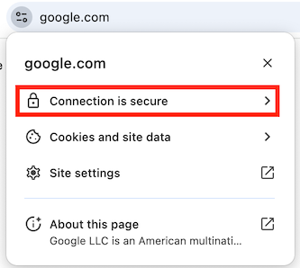

# Intro to Cryptography

If you want to design, build, or manage software services on the Internet, you need to understand at least the basics of cryptography. You don't need to fully understand the math--few people do! And you should never implement the core algorithms yourself--instead always use the canonical library for your chosen programming language. But you do need to understand what these core algorithms are, what they can and cannot do, and how to combine them to create secure systems.

In this tutorial I'll explain the basics of cryptographic hashing, symmetric and asymmetric encryption, digital signatures, and digital certificates. We will use these algorithms in subsequent tutorials, so take the time to read carefully and understand their guarantees and weaknesses.

This tutorial won't magically turn you into a security engineer--that takes years of diligent study, and _a lot_ more detail. But it will help you _talk_ to a security engineer and understand (most of) what they are saying to you. It will also set you up to understand lots of related topics like HTTPS/TLS, authenticated sessions, e-signing, and blockchains.

## Cryptographic Hashing

The first family of algorithms to understand are cryptographic hashing functions. These are one-way functions that turn arbitrarily-sized input data into a relatively small, fixed-sized output value, known as a 'hash' or a 'digest'.

What makes these algorithms incredibly useful are the guarantees they make about that output hash value:

* **Deterministic:** Given the same input data, the algorithm will always produce the same output hash.
* **Collision-Resistant:** The probability that two different inputs will generate the same output hash (known as a 'collision') is extremely low, and decreases exponentially with the size of the output hash. With a 256 or 512-bit output, this probability becomes so low that we can [effectively ignore it](https://stackoverflow.com/a/4014407) in almost all circumstances.
* **Irreversible:** Since the function is one-way, you can't directly calculate the input data from the output hash. You _could_ try hashing every possible input value until you find a match, but that quickly becomes intractable as the number of possible inputs grows.

These guarantees are why people often refer to cryptographic hashes as "fingerprints" of their input data. Our fingerprints are relatively small compared to our entire bodies, but they remain unique (enough) to identify us. Similarly, a cryptographic hashing algorithm can reduce gigabytes of data to a relatively short fingerprint hash that is both deterministic and collision-resistant.

To get a feel for these algorithms, let's generate some hashes at the command line. If you're on MacOS or Linux, open your terminal application. If you're on Windows, use the [Windows Subsystem for Linux](https://learn.microsoft.com/en-us/windows/wsl/about) so you have access to all the same commands. Then run this at your command line:

```bash
echo 'data to hash' | openssl dgst -sha256
```

> [!TIP]
> If you get an error saying "command not found," you need to install `openssl`. Go to your favorite LLM and ask it `how do I install the openssl command line utility on {OS}` replacing `{OS}` with the name of your operating system. If you get some other kind of error, check your version by running `openssl version`--if it's lower than 3.0, you probably need to upgrade.
> If you are totally new to the command line, you might want to go through [this interactive tutorial](https://linuxjourney.com/lesson/the-shell) to learn the basics.

For those who are maybe new to the command line, let's break that down a bit:

1. `echo 'data to hash' |` effectively sends the literal string "data to hash" to the next command after the pipe `|` character as its standard input stream.
1. `openssl` is the Swiss Army knife of cryptographic algorithms for the command line. It can do [a lot](https://linux.die.net/man/1/openssl) of things.
1. `dgst` is the "digest" sub-command for `openssl`, which calculates hashes (aka "digests").
1. `-sha256` tells `openssl` to use the SHA-256 cryptographic hashing algorithm, which produces a 256-bit hash (hence the `256` part of the name). As you might expect, there's also a `-sha512` switch that uses the SHA-512 algorithm, which produces..._you guessed it_...a 512-bit hash!

The output should include the name of the algorithm used, the source of the input data (in this case `stdin` for "standard input"), and the output hash encoded in [hexadecimal](https://en.wikipedia.org/wiki/Hexadecimal). If you run that command multiple times, you should get the same hash every time. That's the deterministic guarantee. 

Now try this command and notice that the resulting hash is different, because the input data is different:

```bash
echo 'more data to hash' | openssl dgst -sha256
```

That's the collision-resistance guarantee. In fact, you could try hashing different strings all day long and you will never get the same hash as the one you got for `'data to hash'` (unless of course you try that exact same string again, which just demonstrates the deterministic guarantee).

Now let's try hashing an entire file, which can be as big as you want. Remove the `echo ... |` part we were using before, and just provide the file's path as the last argument to the `openssl` command.

```bash
openssl dgst -sha256 my-large-file.pdf
```

Regardless of how big the file is, the output hash will still be the same relatively small size--even if the input is gigabytes in size, the output hash will only be 256 bits when using SHA-256. That should make it pretty obvious that these hashes are irreversible--there's no way you could reconstruct a multi-gigabyte file from a 256 bit hash.

> [!TIP]
> We've done all of this at the command line, but there are libraries that do the same thing for all the common programming languages. Just ask your favorite LLM `how do I create a SHA-256 hash in {LANGUAGE}` replacing `{LANGUAGE}` with the name of your programming language.

Cryptographic hashes are very useful in a few different ways:

* **Content Identifiers:** The deterministic and collision-resistant guarantees make cryptographic hashes ideal for compactly identifying potentially large content. For example, if you have a catalog of songs, along with their hashes, you can quickly determine if a new song uploaded to your catalog is the same as one you already have--you only need to compare the short hashes, not the large song files themselves. Decentralized source code control systems like [git](https://git-scm.com/) also use hashes to determine if you already have a commit fetched from a remote branch. 
* **Tamper Detection:** The deterministic guarantee makes cryptographic hashes very useful for detecting if content has changed. For example, if you want to verify that a document or photo hasn't changed since the last time you saw it, you can hash the current version and compare it with a hash you made earlier. Blockchains like bitcoin also use cryptographic hashes to ensure the integrity of the ledger.
* **Irreversible but Verifiable Tokens**: The irreversible and deterministic guarantees mean that hashes can be used to store sensitive information that we don't need to reveal, but may still need to verify in the future. For example, we always store hashes of user passwords, never the passwords themselves. During sign-in, we can still verify the provided password by hashing it and comparing that to our stored hash, but an attacker can't directly calculate the original password from the stored hash. We will discuss the details of password hashing, which are more complicated than this simple example, in a future tutorial.

Lastly, it's important to note that not all hashing algorithms qualify as _cryptographic_ algorithms. Some have much weaker guarantees, especially regarding collision-resistance. For example, the `-md5` algorithm is very fast and produces a much shorter hash than `-sha256` but it will also produce collisions, and it's not considered secure enough for cryptographic uses. The most commonly used cryptographic algorithms these days (January 2025) are the SHA2 family of algorithms, specifically SHA-256 and SHA-512.

Hashing algorithms are very useful, but you can't reverse them, so you can't use them to send a secret message to someone else over a public network like the Internet. For that we need _encryption_.

## Encryption

There are two major types of encryption algorithms:

* **Symmetric:** A single secret key is used to both encrypt and decrypt the data.
* **Asymmetric:** A pair of related keys are used, one to encrypt and the other to decrypt. One key is considered public (can be published and shared with everyone) while the other must be kept private and secret. Because of this public key feature, this style is sometimes called "public key" encryption.

Regardless of the type, the following terms are commonly used when talking about encryption algorithms:

* **plaintext:** The unencrypted data, which might be text, or could be binary content like music, photos, or video. Sometimes we just call this the "message" we want to encrypt.
* **ciphertext:** The encrypted form of the plaintext, which is always binary (base 2), but you can encode those bytes into something that looks more like text by converting them to [base 64](https://en.wikipedia.org/wiki/Base64).
* **encryption:** The process of turning plaintext into ciphertext using a key.
* **decryption:** The process of turning ciphertext back into plaintext using a key.

Explanations of security protocols that involve multiple people talking over a public network traditionally use a standard cast of characters to make the explanations easier to follow:

* **Alice:** who typically wants to send a secret message to Bob.
* **Bob:** who receives messages from Alice and sends replies back.
* **Eve:** an attacker in the middle who can see what is sent across the public network, so the messages must be encrypted.

It's also traditional to use gendered pronouns for these fictional characters, just to make the explanations easier to follow. I'll follow suit, but add a twist by using 'they' for Eve, just to be a bit more inclusive.

### Symmetric Encryption

Symmetric encryption algorithms are the easiest to understand and use. They are similar to codes you might have played with as a child: e.g., shift each character of your secret message forward on the alphabet by _N_ characters, where _N_ is the secret key. If you know the key, you can then decrypt the message by reversing the algorithm: e.g., shift backwards by _N_ characters.

If you prefer physical metaphors, symmetric algorithms are like a box with an integrated lock. The same key can both lock the box and unlock it. Anyone with the key can put a secret message into the box and lock it to protect the message from those who don't have a key. But anyone with a key can still unlock the box and read the message.

The symmetric encryption algorithms we use in computing are much more complicated than the simple codes that kids use, but they still rely on a single key to both encrypt and decrypt, so **that key must remain secret.** The key is passed to the algorithm as another argument, along with the data to encrypt/decrypt. In pseudomoji-code, it looks a bit like this:

```
🔑 = ...secret key...
📄 = ...some secret plaintext message...

// encrypt the plaintext using the secret key
🤐 = encrypt(📄, 🔑)

// decrypt the ciphertext using the same key
📄 = decrypt(🤐, 🔑)
```

The `openssl` command can do encryption as well. Run this at your command line, and when it prompts you for a password, enter one you can remember, and enter it again to verify that you typed it correctly:

```bash
export ENCRYPTED=$(echo 'secret message' | openssl enc -aes-256-cbc -pbkdf2 -base64)
```

Let's break that down:

1. `export ENCRYPTED` declares an [environment variable](https://www.digitalocean.com/community/tutorials/how-to-read-and-set-environmental-and-shell-variables-on-linux) in this shell instance that will hold our ciphertext.
1. `=$(...)` tells the shell to run the contained command, and assign the output to that `ENCRYPTED` environment variable. Most shells also support surrounding the command with back-ticks instead, like `` =`...` `` if you prefer that syntax.
1. `echo 'secret message' |` effectively sends the literal string "secret message" to the command after the pipe `|` character.
1. `openssl` is that same Swiss Army knife of cryptographic algorithms we used before.
1. `enc` is the "encryption" sub-command of `openssl`, which is confusingly used to both encrypt **and** decrypt (we add `-d` when decrypting).
1. `-aes-256-cbc` tells `openssl` to use the [AES](https://en.wikipedia.org/wiki/Advanced_Encryption_Standard) symmetric encryption algorithm, with a 256-bit key, in [cipher block chaining mode](https://docs.anchormydata.com/docs/what-is-aes-256-cbc). You don't need to understand all the particulars of the algorithm and its modes at this point, but there are [several different modes](https://en.wikipedia.org/wiki/Block_cipher_mode_of_operation) AES can use when encrypting data larger than its relatively small block size (16 bytes). The right one depends on your goals. CGM is often recommended these days, but it's unfortunately [not supported on the default MacOS version anymore](https://superuser.com/questions/1824093/command-line-decryption-of-aes-256-gcm-no-longer-working-after-openssl-updated). So we'll use CBC for this tutorial.
1. `-pbkdf2` tells `openssl` to derive the symmetric key from the password you enter. `PBKDF` is an acronym for ["password-based key derivation function,"](https://en.wikipedia.org/wiki/PBKDF2) which is a kind of hashing function that can deterministically generate a symmetric encryption key of a particular size (256 bits in this case) from a password of arbitrary length. This allows you to keep the source of the key in your head instead of a file on disk.
1. `-base64` tells `openssl` to encode the binary ciphertext into [base 64](https://en.wikipedia.org/wiki/Base64), which is safe to paste into a text-based communication medium like email (or print at the command line).

After entering your password, you won't see any output, because it was assigned to the `ENCRYPTED` environment variable. But we can print that to the terminal using this command:

```bash
echo $ENCRYPTED
```

It should look like a bunch of random characters, numbers, and symbols. Without the key or the password it was derived from, an attacker can't read it.

You could now copy/paste/send that to anyone who knows your secret password, and they can decrypt it on the other side. Let's simulate that now by feeding the `ENCRYPTED` value back into `openssl` in decryption mode (add `-d`):

```bash
echo $ENCRYPTED | openssl enc -d -aes-256-cbc -pbkdf2 -base64
```

You'll be prompted for your secret password again, and if you type it correctly, you should see the original "secret message" text as the output! If you mistype the password, or forget it, openssl will refuse to decrypt the message.

Most of the time we want to encrypt whole files instead of short strings, and openssl can do that too. Omit the `echo` part and instead use `-in` to specify the input plaintext file, and `-out` to specify the path where you want it to write the output ciphertext:

```bash
openssl enc -aes-256-cbc -pbkdf2 -in secret_file.pdf -out secret_file.enc
```

You can name the output file anything you want, but it's common to use something like an `.enc` extension to indicate that it's encrypted.

To decrypt, just add the `-d` switch again, and this time specify the encrypted file path as the `-in` argument, and the path where you want the decrypted file written as the `-out` argument. If that output path already exists, the file will just be overwritten, so use a new name:

```bash
openssl enc -d -aes-256-cbc -pbkdf2 -in secret_file.enc -out decrypted_secret_file.pdf
```

> [!TIP]
> We've done all of this at the command line, but there are libraries that do the same thing for all the common programming languages. Just ask your favorite LLM `how do I do symmetric encryption in {LANGUAGE}`, replacing `{LANGUAGE}` with the name of your programming language.

Symmetric encryption is quite fast and very secure if (and only if) you can keep the key secret. But this is relatively easy in some contexts:

* When a single machine needs to both encrypt and decrypt files. For example, [FileVault on MacOS uses AES](https://support.apple.com/guide/deployment/intro-to-filevault-dep82064ec40/web) to encrypt files written to your hard drive.
* When a small group of trusted machines in a private cloud need to decrypt messages encrypted by one of the other machines. Most cloud providers offer a [secrets management service](https://aws.amazon.com/secrets-manager/) that enables machines in the same virtual private cloud to securely access shared secrets like symmetric encryption keys. 

But we often find ourselves in situations where we have two people (the fictional Alice and Bob) who want to send encrypted messages to each other across a public network without an attacker in the middle (Eve) intercepting and reading them. If Alice and Bob both know a particular symmetric key, no problem, but how do they agree on that key without sending it across the public network in a way that Eve can see? If Eve sees the key being passed, they can use it to read all the messages. Even worse, Eve could intercept the messages and replace them with messages of their own: if those are encrypted with the same key, Alice and Bob would never know the difference!

In these situations, we need to turn to _asymmetric encryption_.

### Asymmetric Encryption

Instead of using a single key, asymmetric encryption algorithms use a pair of related keys. One key is private and must be kept secret, just like a symmetric key, but the other key is public, so it can be shared with anyone. You can even publish your public key on your website or social media profile.

Once you generate a pair of these public/private keys, you can use the algorithm to encrypt messages using either key, but the message can only be decrypted using _the other key_. That rule is very important to remember and understand--you can't decrypt using the _same key_, only the _other key_. 

You might be wondering, "if these keys are related, and one of them is public, couldn't an attacker simply _calculate_ the private key from the public key?" Thankfully that's not possible, at least not in any reasonable amount of time. The two keys are mathematically related, but deriving one from the other is not computationally feasible given our current computing technology. The relationship relies on so-called ["trapdoor" calculations](https://en.wikipedia.org/wiki/Trapdoor_function), which are easy to do in one direction, but totally intractable to do in the other. For example, calculating the product of two sufficiently large prime numbers is relatively easy for a computer to do, but factoring that product back into its source primes would take several lifetimes to compute.

Whether you encrypt using the public or private key depends on what you're trying to do, so let's work through an example. Say Alice wants to send Bob an encrypted message that only he can decrypt. As noted above, Bob must keep his private key secret and never share it with anyone, but he can share his public key with anyone. So Bob shares his public key with Alice, or publishes it somewhere Alice (and everyone else) can read it. This means Eve also knows Bob's public key, but that's OK. If Alice encrypts the message using Bob's public key, the message can only be decrypted using Bob's _private_ key, which only Bob can access.

The pseudomoji-code looks like this:

```
🔑 = ...Bob's secret private key...
📛 = ...Bob's public key...
📄 = ...some secret plaintext data...

Alice():
	// encrypt using Bob's public key
	🤐 = encrypt(📄, 📛)
	// send the ciphertext
	Bob(🤐)

Bob(🤐):
	// decrypt using private key
	📄 = decrypt(🤐, 🔑)
```

This works, but what we have so far has a major problem: although an attacker in the middle (Eve) can't _read_ the secret message, Eve can still _intercept and replace_ it with one of their own. After all, Eve knows Bob's public key too. In fact _everyone_ knows Bob's public key. That's the whole point of a public key. So Eve could intercept Alice's original message, encrypt and send a totally different message, and Bob wouldn't know the difference

So how can Bob be sure that the message came from Alice, and not Eve (or someone else for that matter)? Well, Alice has her own key pair too, and can certainly share her public key with Bob. Then Alice can do something like this:

1. Alice first encrypts the plaintext `M` using _Alice's private key_. Only Alice can do this because only Alice has access to her private key. Let's call the output of this first encryption `M1`.
1. Alice then encrypts `M1` again, but this time using _Bob's public key_. Let's call the output of this second encryption `M2`.
1. Alice sends `M2` to Bob over the public network, which Eve can see, but can't decrypt.
1. Only Bob can decrypt `M2` back into `M1` because `M2` was encrypted using Bob's public key, and only Bob has access to the corresponding private key.
1. Bob can then try to decrypt `M1` back into `M` using _Alice's public key_. If `M1` was encrypted using _Alice's private key_, it will work because Bob is using Alice's public key. If it was actually encrypted by Eve, it will fail, because Eve would have used their own private key, because Eve has no access to Alice's private key.
1. If the decryption is successful, Bob can now read `M` **and** be confident that it was sent by Alice.

The pseudomoji-code now looks like this:

```
🔑 = ...Bob's secret private key...
📛 = ...Bob's public key...

🗝️ = ...Alice's private key...
📢 = ...Alice's public key...

📄 = ...some secret plaintext data...

Alice():
	// encrypts using Alice's private key
	🤐 = encrypt(📄, 🗝️)
	// encrypts again using Bob's public key
	🔏🤐 = encrypt(🤐, 📛)
	// send the result to Bob
	Bob(🔏🤐)

Bob(🔏🤐):
	// decrypts first using Bob's private key
	🤐 = decrypt(🔏🤐, 🔑)
	// decrypt again using Alice's public key
	📄 = decrypt(🤐, 📢)
```

Of course, all of this assumes that the public key Bob has is really Alice's public key, and not Eve's public key pretending to be Alice's. Typically Bob will get Alice's key from some trusted source: for example her web site using an HTTPS connection, which is encrypted using a _digital certificate_ that attests to her true legal identity. We'll discuss those in the [Digital Certificates](#digital-certificates) section later in this tutorial.

### Deriving a Symmetric Key from Public Keys

Asymmetric encryption is pretty magical, but it has a few downsides:

* It's much slower and computationally-intensive than symmetric encryption.
* The message length is limited to the size of the asymmetric keys, minus some padding, so you can't say much!

This is why asymmetric encryption is mostly used to agree upon a shared symmetric key so that the parties can switch to using symmetric encryption for the rest of the conversation.

One way to do this is to use asymmetric encryption to encrypt and share a symmetric key--that is, the message we encrypt/decrypt is actually just a symmetric key to use for subsequent messages. Symmetric keys are typically quite small, so the length limitations of asymmetric encryption are not an issue.

But it turns out that asymmetric keys also have a nifty mathematical property that allows Alice and Bob to derive the same shared secret (i.e., a password for deriving a symmetric key) without ever needing to send it in encrypted form across the public network. The algorithm is called Diffie-Hellman Key Exchange, and this video provides a fantastic visual explanation:

[](https://youtu.be/YEBfamv-_do?si=0oXncq05o_nL2wDG)

To get a feel for how this works in practice, we can use `openssl` again to generate two key pairs, one for Alice and one for Bob, and then derive the same shared secret. Let's start by generating a key pair for Alice (this will create new files, so maybe do it in a new directory you can delete later):

```bash
openssl ecparam -name prime256v1 -genkey -noout -out alice_private.pem
openssl ec -in alice_private.pem -pubout -out alice_public.pem
```

Now do the same for Bob:

```bash
openssl ecparam -name prime256v1 -genkey -noout -out bob_private.pem
openssl ec -in bob_private.pem -pubout -out bob_public.pem
```

Alice and Bob must keep their own private key files private, but they can freely share and publish their public key files (the `_public.pem` ones). Once Alice has Bob's public key, and once Bob has Alice's public key, they can both combine them with their own private key to derive a shared secret without ever sending that secret over the network, even in encrypted form. 

Alice does this:

```bash
openssl pkeyutl -derive -inkey alice_private.pem -peerkey bob_public.pem -out alice_shared_secret.key
```

And Bob does this:

```bash
openssl pkeyutl -derive -inkey bob_private.pem -peerkey alice_public.pem -out bob_shared_secret.key
```

Notice that each person is using their _own_ private key, but the _other person's_ public key. 

If you did it correctly, the two shared secret files should be identical. They are binary files, so you can't read them directly, but you can view them encoded in hexadecimal using the `xxd` utility:

```bash
xxd -p alice_shared_secret.key
xxd -p bob_shared_secret.key
```

You can also use the `diff` utility to compare them byte-by-byte:

```bash
diff -q alice_shared_secret.key bob_shared_secret.key
```

If you don't see any output, the files are identical! If you do see differences, then double-check what you ran against the commands above and try again.

Alice and Bob can now use this shared secret as the "password" to the `openssl enc` sub-command (which we used earlier), and let `openssl` derive a new symmetric key from it. 

```bash
openssl enc -aes-256-cbc -pbkdf2 -pass file:alice_shared_secret.key -in secret_file.pdf -out secret_file.enc
```

Since Eve never saw that secret go across the public network, not even in encrypted form, Eve has no chance to decrypting those messages.

But given a sufficiently large number of these encrypted messages, Eve _might_ be able to crack the key using clever [cryptanalysis](https://en.wikipedia.org/wiki/Cryptanalysis), so it's a good idea for Alice and Bob to periodically rotate the shared secret and key. This is done using a protocol like this:

1. Let's say that Alice and Bob are currently encrypting their messages with symmetric key `K`. After some number of messages encrypted by `K` they decide to rotate keys.
1. Both Alice and Bob generate new asymmetric key pairs.
1. Alice and Bob encrypt only their new _public_ keys using `K` and send them to each other. They of course keep their corresponding private keys secret. Although public keys are not secret, encrypting them with `K` autenticates them: i.e., it helps Alice and Bob know that the keys weren't intercepted and replaced.
1. Alice and Bob decrypt each other's new public keys using `K` and derive a new shared secret using Diffie-Hellman with their new private key and the other person's new public key.
1. Alice and Bob now use this new shared secret as the password for deriving the new symmetric key `K1`, which they use to encrypt all subsequent messages, until they decide to rotate keys again.

Diffie-Hellman is very clever, but it's not authenticated, so we have the same issue we had with asymmetric encryption: how does Bob know at the start that he has Alice's real public key, and not an attackers? The answer here is the same as it was before. Bob must get Alice's public key initially from a trusted source, which requires _digital certificates_. But to understand those, we first need to understand _digital signatures_.

## Digital Signatures

Earlier we saw how Alice could first encrypt using her private key, and then encrypt using Bob's public key, to demonstrate that she was the one who encrypted the message, and not an attacker like Eve. But we don't really need to encrypt the _entire_ message twice. And sometimes we want to ensure the authenticity the sender without actually encrypting the message: for example a public contract should remain readable to all, but anyone should be able to verify that a particular set of people signed it. This is where _digital signatures_ come into play.

A digital signature is the digital equivalent of an ink-on-paper signature, only better. In essence, it is a cryptographic hash of the data being signed that is then encrypted by the signer. This signature guarantees two things:

* The message was signed by the person in control of a particular secret key.
* The message hasn't been modified since it was signed.

Just as with encryption there are two different forms of digital signatures: symmetric and asymmetric. Since we were just learning about asymmetric encryption, let's start with the asymmetric form.

## Asymmetric Signatures

To explain the process of asymmetric signatures, let's assume Alice is again wanting to send a message to Bob in a way that he can know for sure Alice sent it. She would follow this sort of process:

1. Alice first hashes the message using a cryptographic hashing algorithm like SHA-256. Let's call the output `H`.
1. Alice then encrypts `H` using her private key. Let's call that `SIG`.
1. If the message being signed isn't secret, Alice can just send the message to Bob along with `SIG`. Otherwise Alice can encrypt the message using Bob's public key (like above).
1. When Bob receives the message plus `SIG` he first decrypts `SIG` back into `H` using Alice's public key. If the message was also encrypted, he decrypts it using his own private key.
1. Bob then re-hashes the message--let's call that `H1`.
1. Bob compares `H1` to `H`: if they match, he knows that it was signed by Alice **and** the message was not changed in-transit. If not, the signature is invalid.

The pseudomoji code looks like this:

```
🗝️ = ...Alice's private key...
📢 = ...Alice's public key...

📄 = ...some message to sign...

Alice():
	#️⃣ = hash(📄)
	🔏 = encrypt( #️⃣, 🗝️ )
	Bob(📄, 🔏)

Bob(📄, 🔏):
	#️⃣ = decrypt(🔏, 📢)
	does #️⃣ == hash(📄) ?

```

If an attacker in the middle intercepts the message and tries to change it, the hashes won't match. If the attacker tries to replace `SIG` with their own signed hash, the decryption of `SIG` will fail because it was encrypted using the _attacker's_ private key, not the true signer's private key.

Since cryptographic hashes are typically much smaller than the original message (which might be a 100 page PDF), encrypting the hash is much more efficient than encrypting the original message twice. It also enables scenarios where you don't want to encrypt the message being signed, as you want it to remain readable by anyone (e.g., a public contract).

To get a feel for how these work, let's use the asymmetric keys we generated in the previous section to sign a document and verify that signature. You can use any document you already have on your machine, or you can create a new one just for testing using a command like this:

```bash
echo "a document to be signed" > document.txt
```

Now let's sign it using Alice's _private_ key that we generated in the previous section:

```bash
openssl dgst -sha256 -sign alice_private.pem -out document.sig document.txt
```

Breaking that down:

* `openssl` is that same Swiss Army knife of cryptographic algorithms.
* `dgst` is the digest sub-command we used in the hashing section, because a signature is an encrypted hash of the document being signed.
* `-sha256` tells `openssl` to use the SHA-256 hashing algorithm.
* `-sign alice_private.pem` specifies which private key to use when encrypting the hash.
* `-out document.sig` names the file to which `openssl` will write the output signature.
* `document.txt` names the file to sign.

The signature file will always be written in binary (base-2), but you can convert it to base-64 if you need to copy/paste it into an email or instant message (or if you just want to view it in your terminal):

```bash
export BASE64SIG=$(openssl enc -base64 -in document.sig)
echo $BASE64SIG
```

The receiver can use a similar command to decode the base-64 back into binary:

```bash
echo $BASE64SIG | openssl enc -base64 -d -out document.sig
```

To verify the signature, use the `dgst` sub-command again, but pass the signer's _public_ key as the `-verify` argument, and the binary signature file as the `-signature` argument.

```bash
openssl dgst -sha256 -verify alice_public.pem -signature document.sig document.txt
```

If the document hasn't changed, the signature should be valid. Try changing document.txt and running just the verify command again--it should then fail because the document is now different than when it was signed!

### Symmetric Signatures

Asymmetric signatures are very useful when the signer and verifier are different actors, but when the signer and verifier are the same, you can use symmetric signatures instead.

For example, web services often need to send some data to the client, which the client needs to include in subsequent requests (e.g., an authenticated session token). Since this is sensitive data, the service needs to ensure the client (or an attacker in the middle) hasn't tampered with the data in-between requests. Since the service is both signing and verifying the data, it can use symmetric signatures, as it can keep the symmetric key secret.

The pseudomoji code looks like this:

```
🔑 = ...secret key...
📄 = ...some message to sign...

sign():
	#️⃣ = hash(📄)
	🔏 = encrypt( #️⃣, 🔑 )
	verify(📄, 🔏)

verify(📄, 🔏):
	#️⃣ = decrypt(🔏, 🔑)
	does #️⃣ == hash(📄) ?
```

These kinds of signatures are often called "Message Authentication Codes" or MACs, as they ensure the data is authentic and not modified since it was signed. The most popular symmetric signature algorithm is known as [HMAC](https://en.wikipedia.org/wiki/HMAC), which is actually a special kind of hashing function that mixes the symmetric key into the data as it hashes it.

Let's get a feel for how this works by using `openssl` to create an HMAC signature for the same `document.txt` file we were using earlier. First we need to create a secret symmetric key. This can be just some random bytes that we generate using `openssl` (let's do 32 bytes = 256 bits, encoded in hexadecimal):

```bash
export SIGNING_KEY=$(openssl rand -hex 32)
```

Now use the `openssl mac` sub-command to generate an HMAC signature using our secret symmetric key:

```bash
openssl mac -digest SHA256 -macopt hexkey:$SIGNING_KEY -in document.txt HMAC
```

Breaking that down:

* `mac` is the `openssl` sub-command for generating and verifying message authentication codes (aka symmetric signatures).
* `-digest SHA256` tells `openssl` to use the SHA-256 algorithm when hashing (you can alternatively use `SHA512` if you wish).
* `-macopt hexkey:$SIGNING_KEY` specifies the signing key to use, which we provide via the `SIGNING_KEY` environment variable that was set when we ran the `openssl rand` command earlier.
* `-in document.txt` names the file to sign.
* `HMAC` specifies we want to use the HMAC symmetric signature algorithm.

Verifying symmetric signatures is even easier than verifying asymmetric ones: you just run the same command on the current version of the document, and compare the resulting signature to the previous one. If they match, the signature is still valid. If not, either the document changed, or the signing key is different. Try changing the contents of `document.txt` and re-run the command to see that the signature changes!

## Digital Certificates

Earlier we noted that Alice and Bob may not know each other previously, so they need a way to exchange public keys over a public network **and** know for sure they got the key they expected. If an attacker in the middle can intercept those keys and swap them for the attacker's public key, the attacker could decrypt, read, re-encrypt and forward the messages without Alice and Bob ever realizing they've been compromised.

The way we handle this on the Internet is through _digital certificates_, which are the digital equivalent of a passport issued by a government. They combine all the algorithms and techniques we've been discussing so far to create a document that Bob can verify to know for sure that the public key in the document really belongs to Alice.

Digital certificates are issued by an authority, which everyone in the conversation decides to trust. Alice gets hers using a process like this:

1. Alice uses her private key to sign a file called a Certificate Signing Request (CSR). This file has a specific format in which she can specify her public key and some properties about herself that the authority will validate. Typically these are properties that would help others identify her, such as her legal name, email address, and maybe mailing address.
1. Alice sends the CSR to a/the trusted Certificate Authority (CA).
1. The CA validates the properties in the CSR. How they do this depends on the properties--e.g., validating an email address can be done by simply sending it a message with a link Alice must click, but validating a legal name and address might require a background/credit check plus sending letters through the post.
1. Once the CA validates all the properties, the CA creates and signs a certificate. The certificate contains all the info from the CSR (including Alice's public key), as well as similar info about the CA (including their public key). It also typically includes a date range during which the certificate should be considered valid.
1. Alice can now share this certificate with others who trust the same CA, like Bob.
1. Bob can verify the CA's signature in the certificate to ensure it really came from the trusted CA.
1. Bob can verify that the identity properties in the certificate match what he knows about Alice.
1. If everything checks out, Bob can be confident that the public key in the certificate really came from Alice.

Of course, all of this comes down to how well the properties in the certificate really identify the person, and the rigor of the CA's validation methods. If the certificate only contains an email address, and Bob doesn't already know Alice's email address, the certificate doesn't really help Bob know for sure that it came from Alice. But if it contains a verified domain name that is owned by Alice, that might be sufficient for Bob to know it's the real Alice.

To get a feel for this process, let's use the private key we created for Alice above to create a CSR. You'll be prompted for the various properties, and you can enter whatever you want since we won't be sending this to a real CA:

```bash
openssl req -new -key alice_private.pem -out certificate.csr
```

If you want to view that generated CSR in its structured form, use this command:

```bash
openssl req -in certificate.csr -text -noout
```

If you want to generate a real certificate from this CSR, we can create what is known as a "self-signed" certificate. This is the equivalent of a passport written in crayon. Applications won't trust it by default, but you can often override this and force the application to use it just for testing purposes:

```bash
openssl x509 -req -days 365 -in certificate.csr -signkey alice_private.pem -out certificate.crt
```

To view that generated certificate in its structured form, use this command:

```bash
openssl x509 -in certificate.crt -text -noout
```

In practice, certificates are mostly issued to organizations and Internet domains to enable HTTPS web sites. You can see these in action in your web browser when it's using HTTPS to talk with a particular domain. If you're using Chrome, click on the site information icon next to the URL in the address bar (screenshots from January 2025):


Then click on the "Connection is secure" link:



Then click on the "Certificate is valid" link:


You should then see the details of the google.com certificate:


> [!TIP]
> Other browsers have similar UI for viewing a site's certificate. If you can't find it, ask your favorite LLM `how do I view a site's certificate in {BROWSER}` replacing `{BROWSER}` with the name of your browser.

You might be wondering, "if both parties need to trust the CA, when did I decide to trust the CA that issued the google.com certificate?" Well, you did when you decided to install and run your particular browser, which comes with a set of trusted CA certificates pre-installed. If the certificate for a given web site was signed by one of those CAs, your browser will automatically trust it. Administrators within a given company can also add their own certificate to browsers installed on the company's machines so they can act as a local CA within the company.

These pre-installed CAs are also called "root CAs" because they can delegate some of their issuing authority to other companies. A digital certificate can actually contain a whole tree of certificates, and as long as the root of that tree is one of the pre-installed trusted root CAs, the browser will trust it.

## Conclusion

That was a lot, but if you read carefully and worked through the example `openssl` commands, you should now have at least a basic understanding of cryptographic hashing, symmetric and asymmetric encryption, digital signatures, and digital certificates. We will build upon this understanding in other tutorials.
