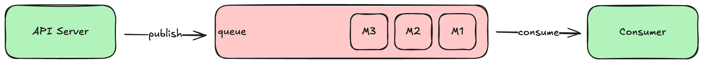
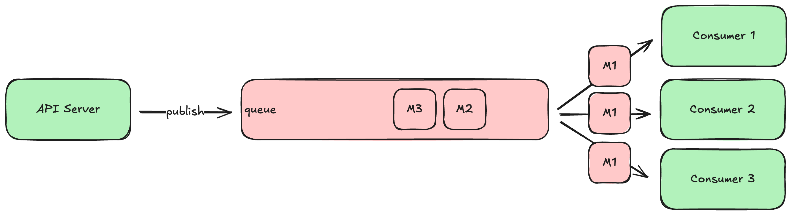
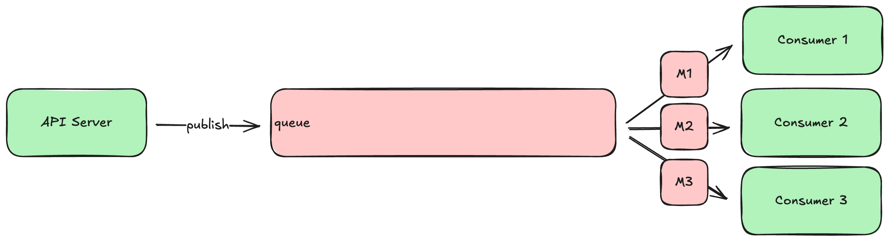
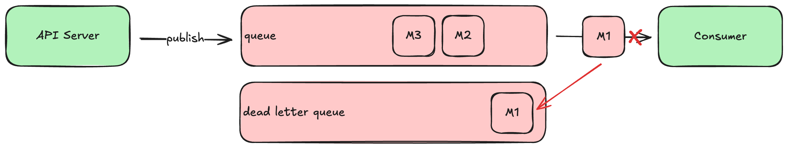

# Message Queues and Asynchronous Work

The primary way clients interact with your system is through your [API servers](api-servers.md), which respond synchronously to the client's request. But there are often tasks related to those requests that don't necessarily need to be done synchronously before the response is written. For example, when a client signs up for a new account, your API server needs to create the account record in the database before responding, but your system could easily send the address verification email _asynchronously_, after the response is sent back to the client. If a client uploads an image to share with others, your API server needs to persist that full resolution file somewhere before responding, but the system could create the thumbnail and medium resolution versions a few seconds later.

To schedule such asynchronous work, we typically use a **durable message queue**. These are a bit like a database in the sense that they guarantee not to lose the messages written to them (that's what the 'durable' part means). But unlike a database they typically don't allow updates, random access, or ad-hoc queries. Instead, **queue consumers** can only read the messages sequentially, in the order they were written.

Popular open-source message queues include:

- [**Kafka**](https://kafka.apache.org/): perhaps the most common choice, feature-rich and well-proven, written in Java.
- [**Redpanda**](https://github.com/redpanda-data/redpanda): a newer drop-in replacement for Kafka written in C++, also offering a hosted "enterprise" version.
- [**RabbitMQ**](https://www.rabbitmq.com/): An older but battle-tested queue written in Erlang.

## Basic Operation

Although each of these have their own special features, they all work pretty much the same way: **producers** (e.g., your API servers) write new messages to the queue, and **consumers** read and process those messages in some way. 

For example during account sign-up, your API server would publish (i.e., write) a NewAccount message to the queue after creating the new account record in the database but before responding to the client. A address verification email consumer, running in a separate process, would consume (i.e., read) that message as soon as it was written, generate a cryptographically-secure confirmation code, and send the verification email to the address provided during sign-up.

The message written to the queue can be any sort of data you want, but we typically use some sort of structured format like JSON or protobuf. It's generally a good idea to include all the data in the message that the consumers will likely need, and not just a record identifier. That way the consumer doesn't have to execute additional queries against your database to do its work.

Some queues require the consumers to track the last message ID successfully processed, and send that back to the queue when asking for the next set of messages. Others keep track of each consumer's position internally, adjusting it when the consumer **acknowledges** a previously-read message (or set of messages) as successfully processed. Either way, the queue ensures that every message is eventually delivered.

Most queue servers support the creation of multiple distinct queues within the same server, often referred to as **topics**, which allow you to segment messages into different logical streams. For example, you might define one topic for new account signups, and a different topic for password resets. Consumers can read messages from their relevant stream and ignore the others.

## Topology

Most queues will allow you to connect multiple consumers to a single queue. How the queue behaves in this scenario depends on the topology you configure for the queue, which ultimately depends on what you're trying to accomplish.

In some cases you will want each consumer to see the same set of messages, which is known as a **broadcast** topology. It looks like this:

Broadcast topology is appropriate when you have different consumers doing different things in response to the same stream of messages. For example, a new account message might be processed by the aforementioned address verification email consumer, as well as a consumer that sends a similar verification SMS to the provided mobile number, as well as a consumer that posts a congratulations message your team's internal Slack workspace. Each consumer needs to see all of the messages, so each message is broadcast to all consumers.

In other cases, you might want to configure the queue so that the multiple consumers _share_ the workload. This is akin to how a [load balancer](building-blocks.md) distributes requests among a set of API server instances. If your system is producing messages faster than a single consumer can process them, you can run multiple instances of that consumer and configure the queue to distribute the messages among the set of consumers. This is often referred to as a **work queue** topology, and it looks like this:

Work queues allow you to scale up and down the set of consumer instances to keep up with the pace of messages being produced, similar to how one scales up and down the number of API servers behind a load balancer to keep up with the request load. If your system gets a sudden rush of traffic, producing more messages than usual, you can simply spin up a few more consumer instances until you drain the backlog.

The more powerful queue servers can actually support both patterns at the same time: multiple logically distinct consumers see all the same messages (broadcast), but each of those logically distinct consumers can have multiple instances running to share the workload (work queue).

## Handling Errors

So far we've discussed how queues operate when everything goes right, but what happens when a consumer fails to process a message successfully? What if the consumer has a bug that causes it to throw an exception or crash every time it tries to process a particular message?

By default, the queue will just try to redeliver this **poison pill** message to the consumer every time it asks for new messages, and the consumer will fail to make progress. As the producer continues to publish new messages, they just accumulate, creating a large backlog that eventually fills the space available to the queue. At that point the queue will start rejecting new messages from the producer, causing errors with your API servers.

We typically avoid this scenario by configuring the queue to retry delivery a fixed number of times, and if it continues to fail, move the unprocessed message to a different queue, known as the **dead letter queue**. This is just a queue, like any other, but it is reserved for messages that were never processed successfully.

Once you fix the bug in the consumer that caused the message processing failure, you can move all the messages accumulated in the dead letter queue back into the main queue. The newly-fixed consumer will naturally receive and process them as if they had just been published, and no messages will be lost!

